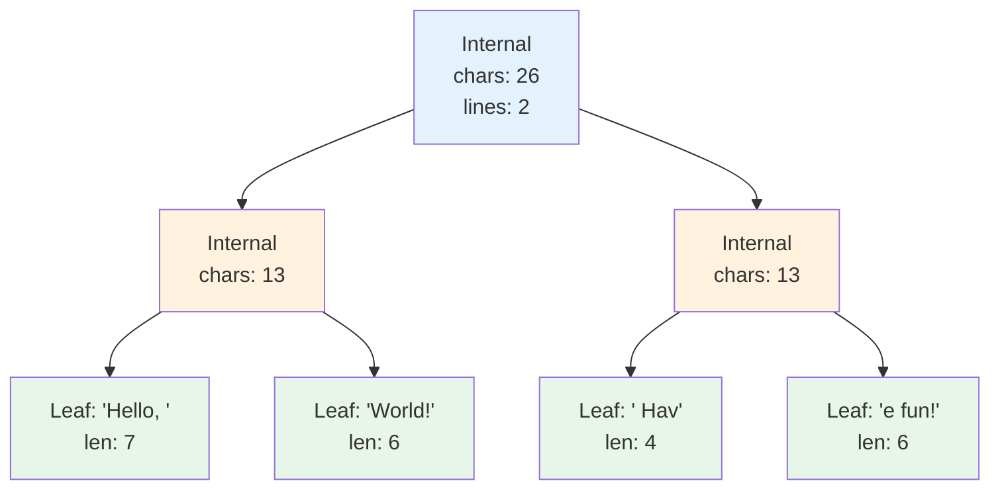
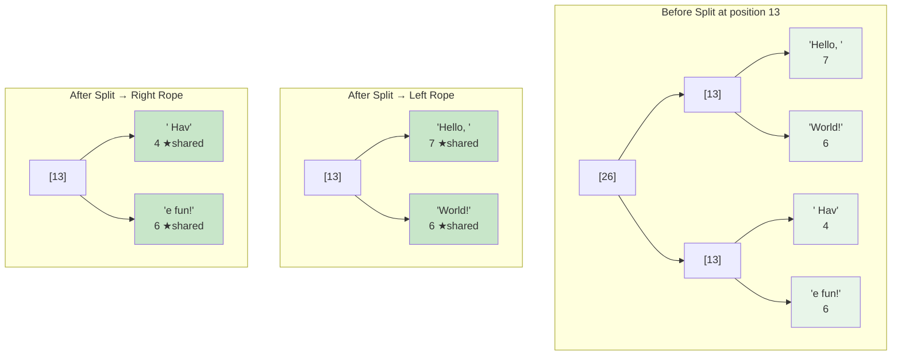
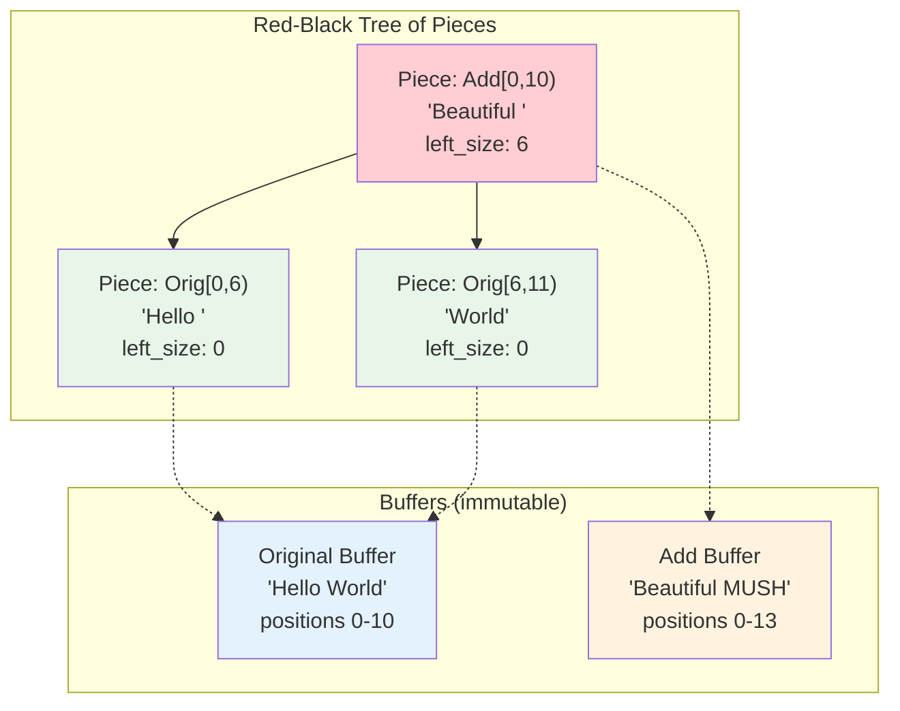
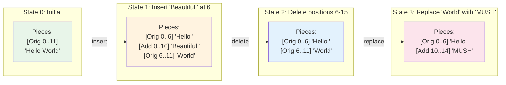
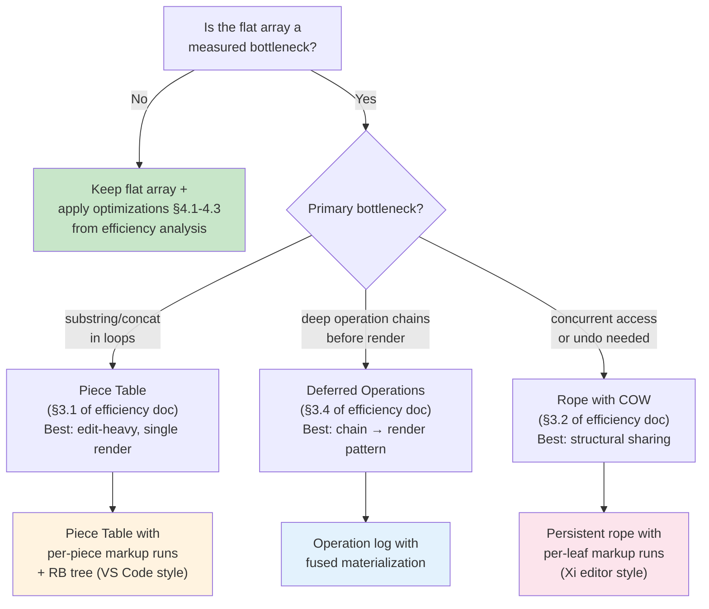
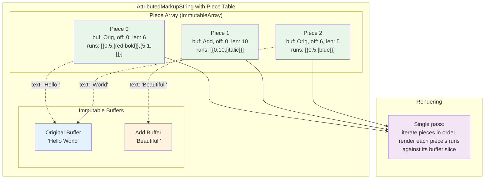

# Xi Editor Rope & VS Code Piece Table: Deep Dive

A detailed exploration of the two most influential text-buffer data structures in modern editors, and how they apply to SharpMUSH's `AttributedMarkupString`.

---

## Table of Contents

1. [Xi Editor: Rope-Based Text Buffer](#1-xi-editor-rope-based-text-buffer)
2. [VS Code: Piece Table Text Buffer](#2-vs-code-piece-table-text-buffer)
3. [Mapping to AttributedMarkupString](#3-mapping-to-attributedmarkupstring)
4. [Comparison & Applicability](#4-comparison--applicability)

---

## 1. Xi Editor: Rope-Based Text Buffer

### 1.1 What Xi Editor Built

[Xi editor](https://xi-editor.io/) (2016–2021, by Raph Levien at Google) was an experimental text editor that pioneered using **ropes** — balanced binary trees of text segments — as its core text buffer. The design is documented in the [Rope Science](https://xi-editor.io/docs/rope_science_00.html) blog series.

The key insight: traditional editors store text as a single contiguous string or gap buffer. Ropes instead store text as **leaves of a balanced tree**, where internal nodes cache aggregate metrics (character count, line count, UTF-16 offset count). This makes positional operations O(log n) instead of O(n).

### 1.2 Core Data Structure

A rope is a **weight-balanced B-tree** where:
- **Leaves** hold text chunks (typically 511–1024 bytes)
- **Internal nodes** hold cached metrics of their subtree
- The tree is balanced by weight (total leaf bytes per subtree)

```
                    ┌─────────────────────────┐
                    │  Internal Node          │
                    │  chars: 26              │
                    │  lines: 1              │
                    │  weight: 26            │
                    └────────┬────────────────┘
                             │
                 ┌───────────┴───────────┐
                 │                       │
        ┌────────┴────────┐     ┌────────┴────────┐
        │  Internal       │     │  Leaf           │
        │  chars: 13      │     │  "World! Hello" │
        │  lines: 0       │     │  len: 13        │
        │  weight: 13     │     └─────────────────┘
        └────────┬────────┘
                 │
        ┌────────┴────────┐
        │                 │
   ┌────┴────┐    ┌───────┴──────┐
   │  Leaf   │    │  Leaf        │
   │  "Hello"│    │  ", World"   │
   │  len: 5 │    │  len: 8     │
   └─────────┘    └──────────────┘
```

### 1.3 Metrics Caching

Each internal node caches **aggregate metrics** for its subtree. This is the key to O(log n) operations:

```
                 ┌──────────────────────────┐
                 │  Metrics {               │
                 │    chars: 26,            │
                 │    lines: 2,            │
                 │    utf16_len: 26,       │
                 │    newline_offsets: [13] │
                 │  }                       │
                 └──────────┬───────────────┘
                            │
             ┌──────────────┴──────────────┐
             │                             │
   ┌─────────┴──────────┐      ┌──────────┴──────────┐
   │  Metrics {         │      │  Metrics {          │
   │    chars: 13,      │      │    chars: 13,       │
   │    lines: 1,       │      │    lines: 1,        │
   │    newlines: [5]   │      │    newlines: [7]    │
   │  }                 │      │  }                  │
   └─────────┬──────────┘      └──────────┬──────────┘
             │                             │
   ┌─────────┴──┐              ┌───────────┴──┐
   │ "Hello\n"  │              │ "World!\n"   │
   │ len: 6     │              │ len: 7       │
   └────────────┘              └──────────────┘
```

**Finding line 2** (zero-indexed) is O(log n): descend the tree, using cached line counts to pick left or right at each node.

### 1.4 Operation: Substring (Split)

Splitting a rope at position `p` produces two ropes that **share structure** with the original:

```
Original rope (26 chars):

           ┌────[26]────┐
           │             │
      ┌──[13]──┐     ┌──[13]──┐
      │        │     │        │
   "Hello, " "World"  "! " "Have fun"
     [7]      [5]     [2]    [8]

Split at position 12 ("Hello, World"):

Left rope (12 chars):          Right rope (14 chars):

     ┌──[12]──┐                      ┌──[14]──┐
     │        │                      │        │
  "Hello, " "World"              "! " "Have fun"    ← SHARED leaf
    [7]      [5]  ▲              [2]    [8]   ▲
                  │                            │
                  └── This leaf "World" is SHARED (immutable, no copy needed)
                       Only path nodes are re-created
```

**Key property**: Splitting creates O(log n) new internal nodes but **shares all unaffected leaves**. No text is copied — only tree structure is adjusted.

**Cost**: O(log n) time, O(log n) new allocations (just path nodes).

Compare to flat array: O(n) scan of all runs + O(length) string copy.

### 1.5 Operation: Concat (Merge)

Merging two ropes creates a new root with the two ropes as children, then rebalances:

```
Rope A:          Rope B:

  ┌─[5]─┐        ┌─[6]─┐
  │      │        │      │
"Hel"  "lo"    "World" "!"
 [3]   [2]      [5]   [1]

After concat(A, B):

        ┌────[11]────┐
        │             │
   ┌──[5]──┐    ┌──[6]──┐      ← Subtrees A and B are SHARED
   │       │    │       │
 "Hel"  "lo"  "World" "!"
  [3]   [2]    [5]   [1]
```

**Cost**: O(log n) for rebalancing. No text is copied — the new root just points to the existing subtrees.

Compare to flat array: O(|a| + |b|) string copy + O(a.runs + b.runs) run array copy.

### 1.6 Operation: Insert

Inserting text at position `p` is split + concat + concat:

```
Original: "Hello World"     Insert "Beautiful " at position 6

Step 1: Split at 6
  Left:  "Hello "      Right: "World"

Step 2: Create leaf for insertion
  New leaf: "Beautiful "

Step 3: Concat(Left, New leaf)
  Result: "Hello Beautiful "

Step 4: Concat(Result, Right)
  Final: "Hello Beautiful World"
```

```
                ┌───────[21]───────┐
                │                  │
        ┌─────[16]──────┐      "World"    ← SHARED from original
        │               │        [5]
   ┌──[6]──┐      "Beautiful "
   │       │          [10]
 "Hello"  " "
  [5]     [1]
    ↑       ↑
    └───────── SHARED from original split
```

**Cost**: O(log n) — three O(log n) operations (split + concat + concat).

Compare to flat array: O(n) string copy + O(n) run array rebuild.

### 1.7 Xi's Copy-on-Write (COW) Approach

Xi uses **persistent data structures** — every edit creates a new version of the tree while sharing structure with the previous version:

```
Version 1: "Hello World"        Version 2: "Hello Beautiful World"

    ┌──[11]──┐                       ┌─────[21]──────┐
    │        │                       │               │
 "Hello "  "World"              ┌──[16]──┐       "World" ←─── SHARED
   [6]      [5]                 │        │         [5]     between V1 & V2
     ↑                       "Hello " "Beautiful "
     │                         [6]       [10]
     └─── SHARED ────────────────┘
```

Both versions can coexist simultaneously in memory. This is essential for:
- **Undo**: Keep the previous tree version
- **Concurrent access**: Read from old version while writing a new one
- **CRDT**: Xi extended ropes with CRDT metadata for collaborative editing

### 1.8 Xi's Rope with Attributes

Xi extended the rope to carry **styling intervals** alongside text. Each leaf can have associated attribute spans:

```
Leaf node:
  ┌─────────────────────────────────┐
  │ text: "Hello World"             │
  │ len: 11                         │
  │ styles: [                       │
  │   { start: 0, end: 5,          │
  │     attrs: [bold] },            │
  │   { start: 6, end: 11,         │
  │     attrs: [italic] }           │
  │ ]                               │
  └─────────────────────────────────┘

  Visualization:
  H e l l o   W o r l d
  ├─bold──┤   ├italic──┤
```

When a leaf is split, the attribute spans are split and distributed to the new leaves — still O(log n) per operation.

### 1.9 Mermaid: Rope Structure



### 1.10 Mermaid: Rope Split Operation



---

## 2. VS Code: Piece Table Text Buffer

### 2.1 History & Motivation

VS Code initially used a **line array** — an array of strings, one per line. In 2018, they replaced it with a **piece table** to solve performance problems with large files and frequent edits. The design is documented in the [VS Code text buffer reimplementation blog post](https://code.visualstudio.com/blogs/2018/03/23/text-buffer-reimplementation).

The original piece table concept comes from **Charles Crowley's 1998 paper** "Data Structures for Text Sequences." VS Code's innovation was combining the piece table with a **red-black tree** for O(log n) positional lookups.

### 2.2 Core Concept

A piece table maintains:
1. **Original buffer**: The initial text content (immutable, never modified)
2. **Add buffer**: An append-only buffer for all inserted text (also never modified once written)
3. **Piece table**: An ordered sequence of "pieces", each pointing to a span in either the original or add buffer

```
┌─────────────────────────────────────────────────────────────┐
│                        PIECE TABLE                           │
│                                                              │
│  ┌────────────────────────────────────────────────────────┐  │
│  │ Original Buffer (immutable):                           │  │
│  │ "This is a document with some text."                   │  │
│  │  0123456789012345678901234567890123456                  │  │
│  └────────────────────────────────────────────────────────┘  │
│                                                              │
│  ┌────────────────────────────────────────────────────────┐  │
│  │ Add Buffer (append-only):                              │  │
│  │ "wonderful "(empty... grows with edits)                │  │
│  │  0123456789                                             │  │
│  └────────────────────────────────────────────────────────┘  │
│                                                              │
│  Pieces (in order):                                          │
│  ┌──────────────────────────────────────────────────────┐    │
│  │ [0] Original [0..10)   → "This is a "               │    │
│  │ [1] Add      [0..10)   → "wonderful "               │    │
│  │ [2] Original [10..36)  → "document with some text." │    │
│  └──────────────────────────────────────────────────────┘    │
│                                                              │
│  Logical text: "This is a wonderful document with some text."│
└─────────────────────────────────────────────────────────────┘
```

### 2.3 Step-by-Step Edit Sequence

Let's trace through three edits on the text `"Hello World"`:

#### Initial State

```
Original: "Hello World"
Add:      ""

Pieces: ┌────────────────────────┐
        │ [0] Orig [0..11) = "Hello World" │
        └────────────────────────┘

Logical text: "Hello World"
```

#### Edit 1: Insert "Beautiful " at position 6

The piece at index 0 spans [0..11). Position 6 falls inside it, so we **split** it and insert a new piece:

```
Original: "Hello World"         (unchanged)
Add:      "Beautiful "           (appended)

Pieces: ┌────────────────────────────────┐
        │ [0] Orig [0..6)   = "Hello "   │  ← left half of split
        │ [1] Add  [0..10)  = "Beautiful "│  ← inserted text
        │ [2] Orig [6..11)  = "World"    │  ← right half of split
        └────────────────────────────────┘

Logical text: "Hello Beautiful World"
          positions: 0─────5 6─────────15 16───20
```

**Key**: No text was copied or moved. The original buffer is untouched. We only created metadata (3 small piece descriptors).

#### Edit 2: Delete "Beautiful " (positions 6–15)

Delete piece [1] entirely:

```
Original: "Hello World"         (unchanged)
Add:      "Beautiful "           (unchanged — never deleted from)

Pieces: ┌────────────────────────────────┐
        │ [0] Orig [0..6)   = "Hello "   │
        │ [1] Orig [6..11)  = "World"    │
        └────────────────────────────────┘

Logical text: "Hello World"
```

**Key**: The add buffer still contains "Beautiful " — it's just not referenced by any piece. This append-only design means the add buffer can support undo by re-adding a piece reference.

#### Edit 3: Replace "World" with "MUSH"

Split piece [1] and insert new text:

```
Original: "Hello World"         (unchanged)
Add:      "Beautiful MUSH"      (appended "MUSH")

Pieces: ┌────────────────────────────────┐
        │ [0] Orig [0..6)   = "Hello "   │
        │ [1] Add  [10..14) = "MUSH"     │  ← points into add buffer
        └────────────────────────────────┘

Logical text: "Hello MUSH"
```

### 2.4 VS Code's Red-Black Tree Enhancement

The naive piece table uses a **linked list** of pieces, making positional lookup O(n). VS Code enhances this with a **red-black tree** where each node is a piece, and each node caches:

- **Left subtree size** (total characters in left children)
- **Left subtree line feed count** (for line-based lookup)

```
              ┌──────────────────────────────┐
              │  Root (Black)                │
              │  piece: Add[0..10)           │
              │  text: "Beautiful "           │
              │  left_size: 6                │
              │  left_lf: 0                  │
              └───────────┬──────────────────┘
                          │
            ┌─────────────┴─────────────┐
            │                           │
   ┌────────┴────────┐       ┌──────────┴─────────┐
   │  Left (Red)     │       │  Right (Red)       │
   │  Orig[0..6)     │       │  Orig[6..11)       │
   │  "Hello "       │       │  "World"           │
   │  left_size: 0   │       │  left_size: 0      │
   │  left_lf: 0     │       │  left_lf: 0        │
   └─────────────────┘       └────────────────────┘
```

**Lookup by character position**: Descend the tree, comparing the target position against `left_size + current_piece_length` to decide left/right — O(log n).

**Lookup by line number**: Same descent using `left_lf` + current piece's line feed count — O(log n).

### 2.5 Mermaid: Piece Table Structure



### 2.6 Mermaid: Edit Sequence Flow



### 2.7 Why VS Code Chose Piece Table Over Rope

From the VS Code blog post, the team benchmarked five approaches:

```
┌─────────────────────────────────────────────────────────────────────┐
│              VS Code's Benchmark Results (2018)                     │
│                                                                     │
│  Data Structure        Memory    File Open   Edit Perf   Seek      │
│  ─────────────────────────────────────────────────────────────────  │
│  Line Array (old)      ★★★★☆    ★★★★★       ★☆☆☆☆      ★★★★★    │
│  Piece Table           ★★★★★    ★★★★★       ★★★★★      ★★★★☆    │
│  Rope                  ★★★☆☆    ★★★★☆       ★★★★☆      ★★★★☆    │
│  Gap Buffer            ★★★★☆    ★★★★★       ★★★★☆      ★★★☆☆    │
│  Red-Black + Buffers   ★★★★★    ★★★★★       ★★★★★      ★★★★★    │
│  (piece table + RB)                                                 │
│                                                                     │
│  ★★★★★ = Excellent   ★☆☆☆☆ = Poor                                 │
│                                                                     │
│  Winner: Piece Table with Red-Black Tree (current VS Code impl)     │
└─────────────────────────────────────────────────────────────────────┘
```

Key findings:
- **Rope** had **higher memory overhead** per node (tree pointers + metrics)
- **Piece table** had **better memory efficiency** because buffers are contiguous
- **Piece table with RB tree** matched rope's O(log n) operations with less overhead
- **Gap buffer** was fast for local edits but O(n) for random-position edits

### 2.8 Piece Table: Insert/Delete Complexity

```
┌─────────────────────────────────────────────────────────────┐
│  Insert at position p:                                       │
│                                                              │
│  1. Find the piece containing position p     → O(log n)     │
│  2. Split that piece into two pieces         → O(1)         │
│  3. Append new text to add buffer            → O(k) amort.  │
│  4. Create new piece for the inserted text   → O(1)         │
│  5. Insert new piece into RB tree            → O(log n)     │
│  6. Rebalance RB tree                        → O(log n)     │
│                                                              │
│  Total: O(log n + k)  where k = length of inserted text     │
│                                                              │
│  Compare: Flat array insert = O(|string| + |runs|)          │
├─────────────────────────────────────────────────────────────┤
│  Delete range [start, end):                                  │
│                                                              │
│  1. Find piece containing start              → O(log n)     │
│  2. Find piece containing end                → O(log n)     │
│  3. Split start-piece at start offset        → O(1)         │
│  4. Split end-piece at end offset            → O(1)         │
│  5. Remove pieces fully within range         → O(log n) ea. │
│  6. Rebalance RB tree                        → O(log n)     │
│                                                              │
│  Total: O(m·log n) where m = pieces in range                │
│  Typically m is small (1-3 pieces)                           │
│                                                              │
│  Compare: Flat array delete = O(|string| + |runs|)          │
└─────────────────────────────────────────────────────────────┘
```

---

## 3. Mapping to AttributedMarkupString

### 3.1 The Challenge: Markup Runs + Text

`AttributedMarkupString` carries two parallel structures:
1. **Text**: A contiguous .NET `string`
2. **Runs**: `ImmutableArray<AttributeRun>` where each run has `{Start, Length, Markups}`

Any alternative data structure must carry markup information alongside text. Here's how each approach maps:

### 3.2 Rope Approach for AttributedMarkupString

Each leaf holds a text chunk **and** its associated markup runs:

```
┌─────────────────────────────────────────────────────────┐
│  RopeLeaf {                                              │
│    text: "Hello "                                        │
│    runs: [{start:0, len:5, markups:[red,bold]},          │
│           {start:5, len:1, markups:[]}]                   │
│  }                                                       │
│                                                          │
│  Visualization:                                          │
│  H e l l o ·                                             │
│  ├red,bold┤                                              │
└─────────────────────────────────────────────────────────┘
```

Splitting a leaf splits both the text and the runs:

```
Split leaf at offset 3:

Before:  ┌────────────────────────────────────────┐
         │ text: "Hello "                          │
         │ runs: [{0,5,[red,bold]}, {5,1,[]}]      │
         └────────────────────────────────────────┘

After:   ┌────────────────────┐  ┌────────────────────┐
         │ text: "Hel"         │  │ text: "lo "         │
         │ runs: [{0,3,[r,b]}] │  │ runs: [{0,2,[r,b]}, │
         └────────────────────┘  │        {2,1,[]}]     │
                                 └────────────────────┘

The run {0,5,[red,bold]} was split into {0,3,[r,b]} and {0,2,[r,b]}.
Offsets are adjusted to be relative to each new leaf.
```

**Concat** creates a new root; if adjacent leaves have compatible runs at the boundary, they can be merged:

```
Concat:
  Leaf A: text="Hel", runs=[{0,3,[bold]}]
  Leaf B: text="lo",  runs=[{0,2,[bold]}]

  Adjacent runs share [bold] → can merge:
  Result leaf: text="Hello", runs=[{0,5,[bold]}]
```

### 3.3 Piece Table Approach for AttributedMarkupString

Each piece references a text span **and** carries its own markup runs (local to the piece):

```
┌─────────────────────────────────────────────────────────────┐
│  Original Buffer: "Hello World"                              │
│  Add Buffer:      "Beautiful "                               │
│                                                              │
│  Piece Table:                                                │
│  ┌─────────────────────────────────────────────────────────┐ │
│  │ Piece 0:                                                │ │
│  │   buffer: Original, offset: 0, length: 6                │ │
│  │   text: "Hello "                                        │ │
│  │   runs: [{start:0, len:5, markups:[red,bold]},          │ │
│  │          {start:5, len:1, markups:[]}]                    │ │
│  ├─────────────────────────────────────────────────────────┤ │
│  │ Piece 1:                                                │ │
│  │   buffer: Add, offset: 0, length: 10                    │ │
│  │   text: "Beautiful "                                    │ │
│  │   runs: [{start:0, len:10, markups:[italic]}]            │ │
│  ├─────────────────────────────────────────────────────────┤ │
│  │ Piece 2:                                                │ │
│  │   buffer: Original, offset: 6, length: 5                │ │
│  │   text: "World"                                         │ │
│  │   runs: [{start:0, len:5, markups:[blue]}]               │ │
│  └─────────────────────────────────────────────────────────┘ │
│                                                              │
│  Logical text: "Hello Beautiful World"                       │
│                ├red,bold┤├─italic──┤├blue┤                  │
└─────────────────────────────────────────────────────────────┘
```

When splitting a piece (for insert/delete), the markup runs within that piece are also split — same as the rope approach, but within a flat piece rather than a tree leaf.

### 3.4 Rendering with Each Approach

```
┌────────────────────────────────────────────────────────────────┐
│  RENDERING COMPARISON                                          │
│                                                                │
│  Current (flat array):                                         │
│    for run in runs do                                          │
│      let segment = text.Substring(run.Start, run.Length)       │
│      // Apply markups to segment                               │
│      sb.Append(rendered) |> ignore                             │
│    → O(n) with excellent cache locality (contiguous array)     │
│                                                                │
│  Rope:                                                         │
│    let rec renderInOrder node =                                │
│      match node with                                           │
│      | Leaf(text, runs) -> renderRuns(text, runs)              │
│      | Internal(left, right) ->                                │
│          renderInOrder left; renderInOrder right                │
│    → O(n) but with pointer chasing (worse cache locality)      │
│                                                                │
│  Piece table:                                                  │
│    for piece in rbTreeInOrder do                               │
│      renderRuns(piece.text, piece.runs)                        │
│    → O(n) with decent locality (pieces are larger than         │
│      rope leaves, so fewer indirections)                       │
└────────────────────────────────────────────────────────────────┘
```

---

## 4. Comparison & Applicability

### 4.1 Operation Complexity Comparison

```
┌──────────────────────────────────────────────────────────────────────┐
│                    COMPLEXITY COMPARISON                             │
│                                                                      │
│  Operation          Flat Array    Rope         Piece Table (+ RB)   │
│  ─────────────────────────────────────────────────────────────────── │
│  Substring          O(n+len)      O(log n)     O(log n)             │
│  Concat             O(a+b)        O(log n)     O(log n)             │
│  Insert at pos      O(n)          O(log n)     O(log n)             │
│  Delete range       O(n)          O(log n)     O(log n)             │
│  Index by char      O(1)          O(log n)     O(log n)             │
│  Index by line       —            O(log n)     O(log n)             │
│  Plain text access  O(1)          O(n) *       O(n) *               │
│  Rendering          O(n)          O(n)         O(n)                 │
│  Memory overhead    Low           High         Medium               │
│  Cache locality     Excellent     Poor         Good                 │
│  Structural sharing None          Full         Partial **           │
│  Implementation     Simple        Complex      Medium               │
│  Immutability       Yes ***       Yes          Partial ****         │
│                                                                      │
│  *     Can be cached / lazily materialized                          │
│  **    Buffers are shared; pieces are new per edit                  │
│  ***   Current implementation uses ImmutableArray                   │
│  ****  Buffers are immutable; piece table metadata is mutable       │
│        (but can be made immutable with persistent RB tree)          │
└──────────────────────────────────────────────────────────────────────┘
```

### 4.2 Memory Layout Comparison

```
FLAT ARRAY (current):
┌─────────────────────────────────────────────────┐
│ string: "Hello Beautiful World"                  │  ← one contiguous allocation
│ runs:   [{0,5,[r,b]},{5,1,[]},{6,10,[i]},...]   │  ← one contiguous array
└─────────────────────────────────────────────────┘
Cache-friendly: sequential memory access during rendering

ROPE:
┌──────┐    ┌──────┐    ┌──────┐    ┌──────┐
│Node 1│───→│Node 2│    │Node 3│───→│Node 4│
│"Hello"    │", "  │    │"Beau"│    │"tifu"│
│ runs │    │ runs │    │ runs │    │ runs │
└──────┘    └──────┘    └──────┘    └──────┘
    ↑           ↑           ↑           ↑
    └───────────┴───────────┴───────────┘
    Scattered in memory — pointer chasing during rendering

PIECE TABLE:
┌────────────────────────────────────────┐  ← Original buffer (contiguous)
│ "Hello World"                          │
└────────────────────────────────────────┘
┌────────────────────────────────────────┐  ← Add buffer (contiguous)
│ "Beautiful "                           │
└────────────────────────────────────────┘
┌──────┐  ┌──────┐  ┌──────┐              ← RB tree nodes (small metadata)
│Piece1│  │Piece2│  │Piece3│
│Orig  │  │Add   │  │Orig  │
│0..6  │  │0..10 │  │6..11 │
└──────┘  └──────┘  └──────┘
Good locality: buffers are contiguous; pieces are small metadata
```

### 4.3 Mermaid: Decision Flowchart for SharpMUSH



### 4.4 SharpMUSH-Specific Applicability

```
┌──────────────────────────────────────────────────────────────────┐
│  SharpMUSH Workload Characteristics:                             │
│                                                                  │
│  1. Strings are typically SHORT (< 8KB, usually < 1KB)           │
│  2. Operations are CHAINED (split → process → rejoin)            │
│  3. Rendering happens ONCE at the end                            │
│  4. Markup runs are usually FEW (< 20 per string)               │
│  5. Strings must be IMMUTABLE (concurrent game state)            │
│  6. No undo needed (one-shot evaluation pipeline)                │
│  7. No collaborative editing (single server)                     │
│                                                                  │
│  Assessment:                                                     │
│                                                                  │
│  Xi Rope:   OVERKILL — Designed for 100MB+ files with           │
│             concurrent editing. The tree overhead exceeds         │
│             the flat-array waste for SharpMUSH's small strings.  │
│             Structural sharing is valuable but the per-node      │
│             cost is too high for strings < 1KB.                  │
│                                                                  │
│  VS Code Piece Table:  GOOD FIT — The "append-only + split"     │
│             model maps well to the MUSH split→process→rejoin     │
│             pattern. Pieces share buffer references, avoiding    │
│             the O(n) copies in substring+concat chains.          │
│             The RB tree is worth it only if piece count > ~20.   │
│                                                                  │
│  Simplified Piece Table (no RB tree):  BEST FIT — For           │
│             SharpMUSH's typical string sizes, a simple           │
│             piece list/array with linear scan is faster than     │
│             an RB tree due to cache locality. Use binary search  │
│             with cached offsets for O(log n) if needed.          │
│                                                                  │
│  RECOMMENDED: Start with flat-array optimizations (#1-3 from    │
│  the efficiency analysis). If profiling confirms a bottleneck,  │
│  implement a simplified piece table without the RB tree.        │
│  The RB tree and rope are both overengineered for typical        │
│  MUSH string sizes.                                              │
└──────────────────────────────────────────────────────────────────┘
```

### 4.5 Mermaid: Piece Table for AttributedMarkupString



### 4.6 Summary Table

| Criterion | Flat Array (Current) | Xi Rope | VS Code Piece Table | Simplified Piece Table |
|-----------|---------------------|---------|--------------------|-----------------------|
| **Complexity** | Simple | High | Medium | Low-Medium |
| **Substring** | O(n) scan | O(log n) | O(log n) | O(n) scan but no copy |
| **Concat** | O(a+b) copy | O(log n) | O(log n) | O(1) amortized |
| **Insert** | O(n) copy | O(log n) | O(log n) | O(n) piece shift |
| **Plain text** | O(1) | O(n) cache | O(n) cache | O(n) cache |
| **Render** | O(n) great cache | O(n) poor cache | O(n) good cache | O(n) good cache |
| **Memory** | Low | High (nodes) | Medium (metadata) | Low-Medium |
| **Immutable** | ✅ ImmutableArray | ✅ Persistent | ⚠️ Needs work | ✅ If using ImmutableArray |
| **Best for** | Small strings, few edits | Large files, undo, collab | Large files, many edits | Medium strings, chain ops |
| **SharpMUSH fit** | ✅ Current | ❌ Overkill | ⚠️ If bottleneck proven | ✅ If flat array insufficient |

---

## References

1. **Xi Editor Rope Science**: https://xi-editor.io/docs/rope_science_00.html — Raph Levien's detailed series on rope data structures, metrics caching, and CRDT extensions.

2. **VS Code Text Buffer Reimplementation**: https://code.visualstudio.com/blogs/2018/03/23/text-buffer-reimplementation — The VS Code team's blog post on replacing their line array with a piece table + red-black tree.

3. **Crowley, "Data Structures for Text Sequences"** (1998): The original piece table paper. Available at https://www.cs.unm.edu/~crowley/papers/sds.pdf

4. **Raph Levien, "Rope Science" talk** (2018): https://www.youtube.com/watch?v=jTBHSMhSl-I — Conference talk covering the design decisions behind Xi's rope.

5. **VS Code Source: pieceTreeTextBuffer**: https://github.com/microsoft/vscode/tree/main/src/vs/editor/common/model/pieceTreeTextBuffer — The actual VS Code piece table implementation in TypeScript.
