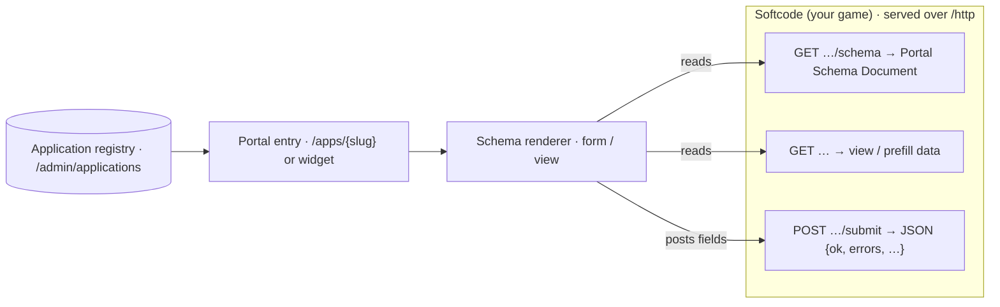

A **Dynamic Application** is a portal page or widget whose entire UI is described by a
JSON **Portal Schema Document** your game emits in softcode — a character-generation
wizard, a "submit your background" form, a character sheet, a faction roster — built
**without writing any C# or Razor**. The portal is a *pure renderer*: softcode owns the
schema, the data, the validation, and every side effect.

This guide has two halves: **[For administrators](#for-administrators)** explains how to
register an application so it appears in the portal, and **[For softcode authors](#for-softcode-authors)**
documents the schema grammar with worked examples. For how this wiki's formatting works,
see the [[Help:Markdown Guide]].

## How the pieces fit together

Three moving parts collaborate. Softcode serves the schema, data, and action endpoints;
two generic Blazor renderers turn the schema into UI; and a DB-backed registry links a
portal entry point (a nav item or a widget) to those endpoints.



Standing one up is **two steps**: (a) install the softcode that defines the routes and
schema, then (b) register the application in the portal admin so a nav entry or widget
points at those routes.

---

## For administrators

Registration is done at **`/admin/applications`** (Wizard and above). A registered
application is a small record linking a portal entry point to your softcode endpoints:

| Field | Meaning |
|---|---|
| **Slug** | URL-safe unique key. Page apps live at `/apps/{slug}`. |
| **Display name** | Label shown in nav and the widget palette. |
| **Icon** | Material icon name (optional). |
| **Kind** | `Page` (a full route) or `Widget` (placeable in a layout zone). |
| **Schema URL** | `GET` route returning the Portal Schema Document. |
| **Data URL** | Optional `GET` route returning view / prefill data. |
| **Submit route** | Optional `POST` base the schema's actions target. |
| **Minimum role** | Lowest role that may see/open the app (see below). |
| **Nav placement** | Nav section hint for `Page` apps (e.g. `main`). |
| **Zones** | Allowed layout zones for `Widget` apps (see below). |
| **Order** | Sort order (ascending) in nav / palette. |

On save, the portal **validates that the Schema URL returns parseable JSON** before the
record is stored, so a typo'd endpoint is caught at registration rather than at view time.

### Application kind

| Kind | Where it appears |
|---|---|
| **Page** | A full-page route at `/apps/{slug}`, optionally surfaced as a nav entry. |
| **Widget** | A placeable tile shown in the `/admin/layout` palette, droppable into zones. |

### Roles (minimum role gate)

`Minimum role` gates both the nav entry and the `/apps/{slug}` route. The hierarchy,
lowest to highest:

| Role | Rank |
|---|---|
| Guest | 0 |
| Player | 10 |
| Builder | 15 |
| Royalty | 20 |
| Wizard | 30 |
| God | 40 |

Registration and editing of applications is **Wizard+**. The viewer's identity is also
forwarded to your HTTP handler, so softcode does the *authoritative* per-field gating
regardless of what the client chooses to render.

### Widget zones

`Widget`-kind applications declare which layout zones they may be dropped into:

| Zone | Position |
|---|---|
| `TopBar` | Across the top |
| `LeftSidebar` | Left rail |
| `RightSidebar` | Right rail |
| `MainContent` | Central column |
| `Footer` | Across the bottom |

### Packaged applications (optional)

Step (b) can also ship as an Area-20 **application package** (`kind: application`) that
depends on the softcode package from step (a). Installing it registers the application;
uninstalling it removes the registration — making the linking step distributable,
versioned, and reversible. Manually registered records have no owning package.

---

## For softcode authors

A Portal Schema Document is one JSON object with `kind: "form"` (input) or
`kind: "view"` (read-only). It is parsed with **snake_case** field names, so softcode
keys like `schema_version`, `visible_to`, `src_field`, and `on_success` map directly.

### The envelope

```json
{
  "kind": "form",
  "schema_version": 1,
  "title": "Character Generation",
  "data_source": "/http/chargen?objid=...",
  "pages": [ /* one or more; a single-page form uses exactly one */ ],
  "actions": { /* named actions buttons & submits reference */ }
}
```

### Pages → sections → elements

- **`pages[]`** — `{ key, title, order, sections[], next?, prev? }`. A multi-step wizard
  has several pages; `next` / `prev` name sibling page keys for navigation controls.
- **`sections[]`** — `{ name, order, visible_to?, elements[], columns? }`. Rendered in
  `order`. **`columns`** controls layout: `1` (default) stacks elements one per row; `2+`
  lays them out in an N-column responsive grid (always one column on mobile).
- **`elements[]`** — each element is either a **field** (an input in a `form`, a value in
  a `view`) or a **display element** (markdown, image, table, keyvalue, divider, button).
  An element's **`span`** (default `1`) lets it occupy more than one column.

### Field element

```json
{
  "kind": "field",
  "key": "strength",
  "label": "Strength",
  "type": "number",
  "options": [ { "value": "str", "label": "Strength" } ],
  "default": 8,
  "help": "Roll 4d6, drop the lowest.",
  "validation": { "required": true, "min": 3, "max": 18, "max_length": 120, "pattern": "^[A-Za-z ]+$" },
  "visible_to": "public"
}
```

Every `type` maps to a portal control:

| `type` | Rendered as | Notes |
|---|---|---|
| `text` | single-line text box | default; honours `max_length` |
| `textarea` | multi-line text box | |
| `mstring` | multi-line text box | markup string — ANSI / MXP styling survives |
| `number` | numeric stepper | honours `min` / `max` |
| `slider` | slider | honours `min` / `max`, step 1 |
| `boolean` | toggle switch | |
| `select` | single-choice dropdown | needs `options` |
| `multiselect` | multi-choice dropdown | needs `options` |
| `radio` | radio button group | needs `options` |
| `date` | date picker | ISO `yyyy-MM-dd` |
| `hidden` | *(no control)* | carries a value invisibly |
| `computed` | display-only | read-only value |

**Validation hints are advisory UX only.** `required`, `min`, `max`, `max_length`, and
`pattern` drive immediate input feedback, but **softcode is the authoritative validator**
and returns binding errors in the action response (below). There is deliberately **no
client-side `show_if` predicate** — conditional fields are handled by *softcode-driven
progression* (below).

### Display elements

Usable in a `view` and also within a `form`:

| `kind` | Renders | Key properties |
|---|---|---|
| `markdown` | formatted prose | `value` |
| `image` | an image | `src_field` (data key), `alt` |
| `table` | a data table | `rows_field` (data key), `columns[]` of `{key,label}` |
| `keyvalue` | a label/value list | `fields[]` (data keys) |
| `divider` | a horizontal rule | — |
| `button` | an action button | `label`, `action` |

```json
{ "kind": "markdown", "value": "## Welcome, adventurer" }
{ "kind": "image",    "src_field": "portrait", "alt": "Portrait" }
{ "kind": "table",    "rows_field": "inventory", "columns": [ { "key": "item", "label": "Item" } ] }
{ "kind": "keyvalue", "fields": [ "fullname", "alias", "faction" ] }
{ "kind": "divider" }
{ "kind": "button",   "label": "Roll Stats", "action": "roll" }
```

### Actions and the response envelope

Buttons and submits reference a named action. `transport` is always `"http"` in v1:

```json
"actions": {
  "submit": {
    "transport": "http", "method": "POST",
    "route": "/http/chargen/submit",
    "payload": "fields",
    "on_success": { "navigate": "/character/%name%", "toast": "Created!" },
    "on_error":   { "bind_field_errors": true }
  }
}
```

Your `POST` handler validates and replies with a JSON envelope
(`@respond/type application/json; think json(...)`):

| Member | Meaning |
|---|---|
| `ok` | `true` succeeds; `false` binds `errors` to the form |
| `errors` | `{ "field": "msg", "_global": "msg" }` — `_global` → snackbar, keyed → per-field |
| `fields` | values merged back when the action set `on_success.merge_fields` |
| `schema` | a **replacement** Portal Schema Document — the renderer re-renders it |
| `redirect` | URL to navigate to |
| `message` | a toast / message |

### Softcode-driven progression (the key idea)

The client holds **no branching logic**. Any action POSTs the current (possibly
incomplete) field values to your route, and softcode decides what comes back. To show a
field only after a choice is made, return a **replacement `schema`** in the response
reflecting that choice — the renderer simply re-renders it. Conditional fields, dynamic
pages, and computed defaults are all realized this way, never by a client predicate.

### Authoring the JSON in softcode

Schemas are emitted with nested `json(object,...)` / `json(array,...)` expressions on an
attribute of your HTTP handler object.

> **Numeric-argument footgun.** Any `json()` call with **ten or more arguments** must
> preserve numeric argument order (`%10` must not sort before `%2`). Field-heavy schemas
> hit this constantly. Prefer small reusable `FN`*` helper attributes (one element each)
> over one giant hand-written `json()` expression — it keeps schemas readable and sidesteps
> the argument-count trap.

---

## Worked example: a character-application form

This is the bundled `chargen` example. The `GET` route returns a single-page `form` with
four fields (a required name, a concept, a class `select`, and a multi-line background),
plus a `submit` action:

```mushcode
&GET`CHARGEN`SCHEMA handler=@respond/type application/json; think json(object,
  kind,json(string,form),
  schema_version,json(number,1),
  title,json(string,Character Application),
  pages,json(array,json(object,
    key,json(string,main),title,json(string,Application),order,json(number,1),
    sections,json(array,json(object,
      name,json(string,About),order,json(number,1),
      elements,json(array,
        json(object,kind,json(string,field),key,json(string,charname),label,json(string,Character Name),type,json(string,text),validation,json(object,required,json(boolean,true),max_length,json(number,60))),
        json(object,kind,json(string,field),key,json(string,concept),label,json(string,Concept),type,json(string,text)),
        json(object,kind,json(string,field),key,json(string,class),label,json(string,Class),type,json(string,select),options,json(array,
          json(object,value,json(string,fighter),label,json(string,Fighter)),
          json(object,value,json(string,wizard),label,json(string,Wizard)),
          json(object,value,json(string,rogue),label,json(string,Rogue)))),
        json(object,kind,json(string,field),key,json(string,background),label,json(string,Background),type,json(string,mstring))))))),
  actions,json(object,submit,json(object,
    transport,json(string,http),method,json(string,POST),route,json(string,/http/chargen/submit),payload,json(string,fields),
    on_success,json(object,toast,json(string,Application submitted!)),
    on_error,json(object,bind_field_errors,json(boolean,true)))))
```

The portal renders that schema roughly like this:

{width=440}

The matching `POST` handler validates and returns the envelope — an error if the name is
blank, otherwise a success with a redirect:

```mushcode
&POST`CHARGEN`SUBMIT handler=@respond/type application/json; think firstof(
  if(not(t(edit(json_query(%1,get,charname),",))),
    json(object,ok,json(boolean,false),errors,json(object,charname,json(string,A character name is required.)))),
  json(object,ok,json(boolean,true),message,json(string,Application received. Staff will review it.),redirect,json(string,/characters)))
```

Register that pair at `/admin/applications` (slug `chargen`, kind `Page`, schema URL
`http/chargen/schema`, submit route `http/chargen`, minimum role `Player`) and a live
`/apps/chargen` form appears in the portal.
