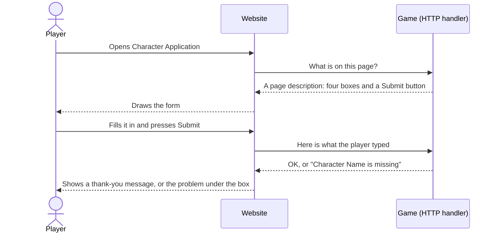
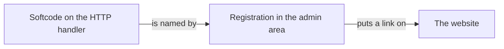
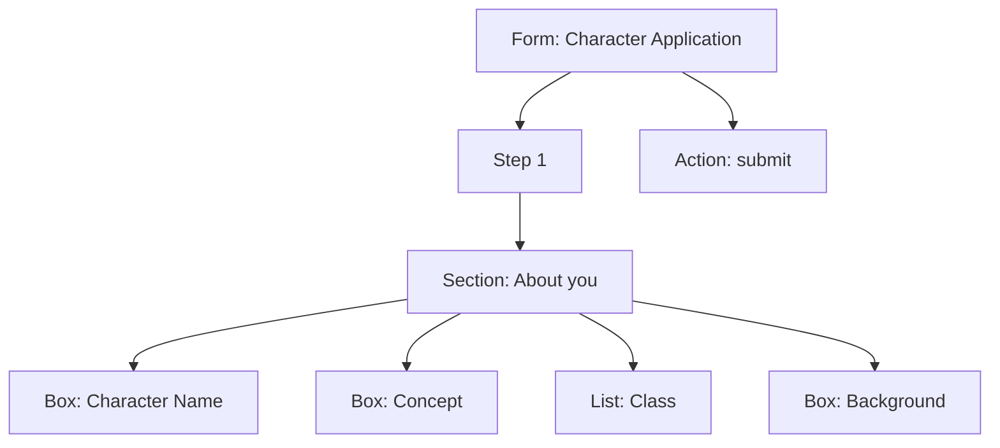
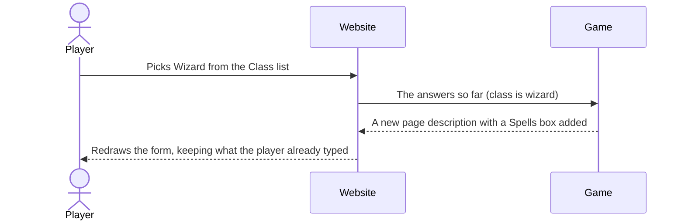

An **application** is a page or panel on your game's website that your game builds for
itself. A character application form, the Jobs page where players ask staff for help, and
a character card on the front page can all be applications.

Nobody has to change the website to add one. Staff write the page in softcode, the same
way they write `+commands`, and the website draws whatever the game describes.

This guide has three parts. Read the one that fits you:

| You are | You want to | Read |
|---|---|---|
| A player | find an application and fill it in | [Using applications](#using-applications) |
| Staff | add a ready-made application to your game | [Adding an application](#adding-an-application) |
| A softcoder | build an application of your own | [Building your own application](#building-your-own-application) |

For how this wiki's own formatting works, see the [[Help:Markdown Guide]].

## Words used in this guide

| Word | What it means |
|---|---|
| **Application** | A page or panel on the website that the game describes in softcode. |
| **Page application** | An application with a page of its own, at an address like `/apps/chargen`, and a link in the sidebar. |
| **Widget application** | An application shown as a panel inside another page, such as the front page. |
| **HTTP handler** | The object in your game that answers the website. It is usually `#8`; type `@config http_handler` to check. |
| **Route** | One address the HTTP handler answers, such as `/http/chargen/schema`. Each route is an attribute on the handler, such as ``GET`CHARGEN`SCHEMA``. |
| **Page description** | The text a route sends back to say what is on the page: its title, its boxes and its buttons. Developers call it a *schema*. |
| **Package** | A bundle of softcode that staff install from the admin area in one step. |

## How an application works

The website never decides what an application shows. Each time someone opens one, the
website asks the game, and the game answers.


```mermaid
sequenceDiagram
  actor P as Player
  participant W as Website
  participant G as Game (HTTP handler)
  P->>W: Opens Character Application
  W->>G: What is on this page?
  G-->>W: A page description: four boxes and a Submit button
  W-->>P: Draws the form
  P->>W: Fills it in and presses Submit
  W->>G: Here is what the player typed
  G-->>W: OK, or "Character Name is missing"
  W-->>P: Shows a thank-you message, or the problem under the box
```

The same steps in words:

1. A player opens an application on the website.
2. The website asks your game what belongs on that page.
3. Your game answers with a page description, and the website draws it.
4. The player fills it in and presses a button.
5. The website sends what they typed to your game.
6. Your game checks it, stores it, and says whether it worked. The website shows the answer.

Because the game does all the deciding, staff can change an application in-game and the
website shows the change the next time the page is opened.

---

## Using applications

**Where to find them.** Page applications appear as links in the website's sidebar. Your
game chooses which group of the sidebar each one sits in; the Jobs application, for
example, sits under *Support*. Widget applications appear as panels on other pages, such
as the front page or the play screen.

**Filling in a form.**

- Type into the boxes and pick from the lists. A box marked with `*` must be filled in.
- A form with several steps shows *Step 1 of 3* at the top, with **Next** and **Back**
  buttons. Nothing is sent until you press **Submit** on the last step.
- Some forms change as you go. Picking a class, for example, can add questions that only
  that class needs.

**After you press Submit.**

- If everything is fine, a short message appears, such as *Thank you! Staff will read your
  application soon.* Some forms then take you to another page.
- If something needs fixing, red text appears under the box it is about. What you typed is
  still there; fix it and press **Submit** again.

**Can't find an application?** Some are only for certain players: staff tools, or forms
for players who already have a character. If you think you should see one and don't, ask
your game's staff.

---

## Adding an application

Every application has two halves, and you need both:


```mermaid
flowchart LR
  A["Softcode on the HTTP handler"] -->|is named by| B["Registration in the admin area"]
  B -->|puts a link on| C["The website"]
```

1. **The softcode** lives on your HTTP handler. It describes the page and decides what
   happens when someone presses a button.
2. **The registration** is a short record in the admin area. It names the application,
   gives it an address and a sidebar link, and says who may open it.

The softcode without a registration does nothing visible. A registration without the
softcode is a link to an empty page.

### The easy way: install a package

Many applications come as a pair of packages: one with the softcode, and one ending in
`-app` that registers it. The Jobs application, for example, is the `jobs` package plus
the `jobs-app` package.

1. Open **Packages** in the admin area and choose **Browse**.
2. Install the softcode package first (`jobs`), then the `-app` package (`jobs-app`).
   The `-app` package will not install without the first one, and tells you so.
3. If the package asks who may open the application, pick a role (see
   [Who can open it](#who-can-open-it)).

The application's link appears in the sidebar straight away. Uninstalling the `-app`
package removes the link and the registration but leaves the softcode in place;
uninstall the softcode package as well to remove everything.

### By hand: register it yourself

If someone gave you the softcode, or you wrote it, register it yourself. Open
**Applications** in the admin area (`/admin/applications`) and choose **New application**.
You need to be a wizard, or to hold the `applications.admin` permission.

| Box | What to put in it | Jobs uses |
|---|---|---|
| **Slug** | A short name with no spaces. It becomes the address, `/apps/<slug>`. You can't change it later. | `jobs` |
| **Display name** | The name players see in the sidebar. | `Jobs` |
| **Kind** | **Page** for a page of its own, **Widget** for a panel inside other pages. | Page |
| **Minimum role** | The lowest role that may open it. See [Who can open it](#who-can-open-it). | Player |
| **Permission** | Optional. A permission players must also hold, such as `jobs.staff`. Leave it empty if the role is enough. | (empty) |
| **Schema URL** | The route that sends the page description. Whoever wrote the softcode will tell you. | `http/jobs/schema?at={path}` |
| **Data URL** | Optional. The route that sends the information shown on the page. | `http/jobs/data?at={path}` |
| **Submit route** | Optional. A note of where the buttons send their answers. The page description already says this, so you can leave it empty. | `http/jobs/act` |
| **Icon** | Optional. The name of a [Material icon](https://fonts.google.com/icons), such as `support_agent`. | `support_agent` |
| **Nav placement** | The sidebar group the link goes in: `Play`, `World`, `Build` or `Manage`, or a new name of your own, which makes a new group. Leave it empty to have no link. | `Support` |
| **Order** | Where the link sits in its group. Lower numbers come first. | `40` |

Press **Save**. Before it saves, the website asks your game for the page description. If
the game does not answer with one, you see an error and nothing is saved; see
[When something goes wrong](#when-something-goes-wrong).

### Who can open it

**Minimum role** sets the lowest role that sees the sidebar link and may open the page.
Everyone above that role can open it too.

| Minimum role | Who can open it |
|---|---|
| Guest | Everyone, including visitors who have not signed in |
| Player | Anyone signed in with a character |
| Builder | Builders and everyone above them |
| Royalty | Royalty, wizards and God |
| Wizard | Wizards and God |
| God | Only God |

**Permission** narrows it further. With `jobs.staff` there, only players whose roles give
them that permission see the link. The `@permission` and `@role` commands manage
permissions; see `help @permission`.

This only controls who sees the link and the page. What each person sees *on* the page is
up to the softcode, which knows who is looking.

### Page or widget

| Kind | Where it shows |
|---|---|
| **Page** | A page of its own at `/apps/<slug>`, with a link in the sidebar if you set a nav placement. |
| **Widget** | A panel you place on other pages. Open **Layout** in the admin area, find it in the list of widgets, and drag it where you want it. **Allowed zones** limits where it may go: the top bar, either sidebar, the main column or the footer. |

### When something goes wrong

| What you see | Why it usually happens | What to do |
|---|---|---|
| An error when you press **Save** | The softcode isn't installed, the Schema URL has a typo, or the softcode has a mistake in it. | Check the softcode is on your HTTP handler and the Schema URL matches the route's attribute name. |
| A player can't see the link | Their role is below the minimum role, they lack the permission, or Nav placement is empty. | Check those three boxes. |
| The page shows *Nothing to display* | The softcode sent no information that this person is allowed to see. | That can be on purpose. If not, check the Data URL route. |
| **Submit** does nothing, or shows an error | The route the button sends to is missing or has a mistake. | Check the route named in the page description exists on the HTTP handler. |
| A change to the softcode doesn't show | The page was already open. | Reload the page. |

To remove an application, open it under **Applications** and remove it. That only takes it
off the website; the softcode stays on your HTTP handler until you delete it.

---

## Building your own application

This part is for softcoders. It builds the Character Application form from start to
finish, then lists everything a page description can hold.

### What a page description looks like

A page description is written in JSON, a common way of writing nested lists of named
values. It is built like an outline:


```mermaid
flowchart TD
  D["Form: Character Application"] --> P1["Step 1"]
  D --> A["Action: submit"]
  P1 --> S1["Section: About you"]
  S1 --> E1["Box: Character Name"]
  S1 --> E2["Box: Concept"]
  S1 --> E3["List: Class"]
  S1 --> E4["Box: Background"]
```

- The **form** has a title and a list of **steps**. Most forms have one step; a form with
  several shows **Next** and **Back** buttons.
- Each step has **sections**. A section is a titled card on the page.
- Each section has **elements**: boxes to type in, lists to pick from, text, pictures,
  tables and buttons.
- The form also names its **actions**: what each button does.

Here is a small form with one box and a Submit button:

```json
{
  "kind": "form",
  "title": "Character Application",
  "pages": [
    { "sections": [
      { "name": "About you",
        "elements": [
          { "kind": "field", "key": "charname", "label": "Character Name", "type": "text" }
        ] }
    ] }
  ],
  "actions": {
    "submit": { "route": "/http/chargen/submit" }
  }
}
```

- `"kind": "form"` makes it a form. Use `"view"` for a page that only shows information.
- `"key": "charname"` is the name the box's answer is sent under. `"label"` is what the
  player reads.
- An action named `submit` puts a **Submit** button at the bottom. Its `route` is where
  the answers go.

### Step 1: write the page description in softcode

You build JSON in softcode with the `json()` function. `json(string,Hello)` makes a piece
of text, and `json(object,name,value,...)` makes a group of named values. Building every
box by hand gets long, so start with two small helper attributes on your HTTP handler:

```mushcode
&FN`FIELD #8=json(object,kind,json(string,field),key,json(string,%0),label,json(string,%1),type,json(string,%2))
&FN`CHOICE #8=json(object,value,json(string,%0),label,json(string,%1))
```

- ``FN`FIELD`` makes one box. Give it the key, the label and the type:
  ``u(FN`FIELD,concept,Concept,text)``.
- ``FN`CHOICE`` makes one choice in a list: ``u(FN`CHOICE,fighter,Fighter)``.

Now the page description itself. A website request for `/http/chargen/schema` runs the
attribute ``GET`CHARGEN`SCHEMA``:

```mushcode
&GET`CHARGEN`SCHEMA #8=@respond/type application/json; think json(object,
  kind,json(string,form),
  title,json(string,Character Application),
  pages,json(array,json(object,
    sections,json(array,json(object,
      name,json(string,About you),
      elements,json(array,
        u(FN`FIELD,charname,Character Name,text),
        u(FN`FIELD,concept,Concept,text),
        json(object,kind,json(string,field),key,json(string,class),label,json(string,Class),type,json(string,select),
          options,json(array,
            u(FN`CHOICE,fighter,Fighter),
            u(FN`CHOICE,wizard,Wizard),
            u(FN`CHOICE,rogue,Rogue))),
        u(FN`FIELD,background,Background,textarea)))))),
  actions,json(object,
    submit,json(object,route,json(string,/http/chargen/submit))))
```

> **Typing it in.** The code is spread over several lines to make it easier to read. Every
> line ends just after a comma or an opening bracket, so to enter it, delete the line
> breaks and the spaces at the start of each line, and send it as one line.

- `@respond/type application/json` tells the website the answer is JSON.
- `think` sends the page description back to the website.
- The Class list is written out in full because it needs `options`, the list of choices.

### Step 2: answer the Submit button

When the player presses **Submit**, the website sends their answers to
`/http/chargen/submit`, which runs ``POST`CHARGEN`SUBMIT``. The answers arrive in `%0`,
and `json_query(%0,extract,$.charname)` reads the one typed into the Character Name box.

The attribute must answer with `ok` set to true or false:

```mushcode
&POST`CHARGEN`SUBMIT #8=@respond/type application/json; think if(strlen(trim(json_query(%0,extract,$.charname))),
  json(object,ok,json(boolean,true),message,json(string,Thank you! Staff will read your application soon.)),
  json(object,ok,json(boolean,false),errors,json(object,charname,json(string,Please give your character a name.))))
```

- If the name is filled in, the player sees *Thank you! Staff will read your application
  soon.*
- If it is empty, the player sees *Please give your character a name.* under the
  Character Name box. The text goes under that box because the error is filed under
  `charname`, the box's key.

This example only checks the answers. A real form would also store them, for example with
`@mail` to staff or by setting attributes on the player.

### Step 3: register it and try it

Register it as in [By hand: register it yourself](#by-hand-register-it-yourself): slug
`chargen`, kind **Page**, minimum role **Player**, Schema URL `http/chargen/schema`, nav
placement `Play`. Open `/apps/chargen` and you see:

{width=440}

### Changing the form as the player goes

The website never decides on its own to show or hide a box. When the form should change,
the game sends a new page description, and the website draws that one instead.


```mermaid
sequenceDiagram
  actor P as Player
  participant W as Website
  participant G as Game
  P->>W: Picks Wizard from the Class list
  W->>G: The answers so far (class is wizard)
  G-->>W: A new page description with a Spells box added
  W-->>P: Redraws the form, keeping what the player already typed
```

To set this up:

1. On the Class box, add `"triggers_action": "class_changed"`. The website then runs that
   action whenever the choice changes.
2. Add a `class_changed` action whose route points at a new attribute.
3. In that attribute, read `class` from `%0` and answer with `ok` true and a `schema`: the
   whole page description again, with the extra box when the class is `wizard`.

You can do the same with a button instead: a `button` element names the action it runs.

### Showing information instead of asking for it

A `view` shows information and has no boxes to fill in. A character card, a list of
upcoming scenes and a faction roster are all views. A view's information comes from a
second route, the **Data URL**, which answers like this:

```json
{
  "fields": {
    "name":    { "value": "Ada" },
    "concept": { "value": "Sky pirate with a secret" },
    "notes":   { "value": "Owes the guild money", "visible": false }
  }
}
```

The page description lists what to show, in order, using the same keys:

```json
{
  "kind": "view",
  "title": "Character card",
  "pages": [ { "sections": [ { "elements": [
    { "kind": "field", "key": "name",    "label": "Name" },
    { "kind": "field", "key": "concept", "label": "Concept" },
    { "kind": "field", "key": "notes",   "label": "Staff notes" }
  ] } ] } ]
}
```

A value marked `"visible": false`, or left out entirely, is not shown. That is how one
page can show staff notes to staff and hide them from everyone else.

On a form, the Data URL fills in boxes before the player starts typing, which is useful
for an "edit your profile" page.

### Knowing who is looking

Every route can tell who is using the website: `%q<viewer>` holds the objid of the
character the person is signed in as, or is empty for a visitor who is not signed in. So
`name(%q<viewer>)` is their character's name. Use it to decide what each person sees,
and to check they are allowed to do what a button asks. The minimum role only hides the
link; your softcode is what actually protects your data.

### Reference

#### Box types

Each `field` element has a `type`:

| `type` | What the player sees |
|---|---|
| `text` | A one-line box. This is the type when none is given. |
| `textarea` | A box several lines tall. |
| `mstring` | A box several lines tall that keeps colour and other markup. |
| `number` | A box for a number, with up and down arrows. |
| `slider` | A slider. Set its ends with `min` and `max` in `validation`. |
| `boolean` | An on/off switch. |
| `select` | A list to pick one choice from. Needs `options`. |
| `multiselect` | A list to pick several choices from. Needs `options`. |
| `radio` | A set of round buttons to pick one choice from. Needs `options`. |
| `date` | A calendar to pick a date from. |
| `hidden` | Nothing. It carries a value along with the answers without showing it. |

A `field` can also have:

| Setting | What it does |
|---|---|
| `help` | A short hint shown under the box. |
| `default` | The value the box starts with. |
| `options` | The choices for `select`, `multiselect` and `radio`: a list of `{ "value": "...", "label": "..." }`. |
| `validation` | Quick checks the website makes before anything is sent: `required` (true or false), `min` and `max` for numbers, `max_length` for text, and `pattern`. Your softcode should still check everything itself. |
| `triggers_action` | An action to run whenever the value changes. |
| `span` | How many columns the box takes when its section has several. |

#### Other elements

| `kind` | What it shows | What it needs |
|---|---|---|
| `markdown` | Formatted text, written in Markdown: bold, lists, links and headings. | `value`: the text. |
| `image` | A picture. | `src_field`: the data key holding the picture's address; `alt`: a description of it. |
| `table` | A table. | `rows_field`: the data key holding the rows; `columns`: a list of `{ "key": "...", "label": "..." }`. |
| `keyvalue` | A list of names and values. | `fields`: the data keys to show. |
| `timeline` | A list of dated entries, like comments on a job. | `rows_field`: the data key holding the entries. |
| `divider` | A line across the section. | Nothing. |
| `button` | A button. | `label`: its text; `action`: the action it runs. `confirm` asks a question first. |

A section can set `"columns": 2` (or more) to put its elements side by side. On a phone
they stack in one column.

#### Actions

An action needs only a `route`. It can also have:

| Setting | What it does |
|---|---|
| `on_success` | `toast`: a message to show when it works. `navigate`: an address to go to afterwards. `merge_fields`: fill boxes with the `fields` the game sends back. `reset_fields`: empty every box first. |
| `on_error` | `bind_field_errors`: show errors under their boxes (on unless set to false). |

#### What a button's route answers

| Setting | What it does |
|---|---|
| `ok` | `true` if it worked, `false` if not. Always include it. |
| `message` | A short message to show. |
| `errors` | Problems to show. Each one is filed under a box's key, or under `_global` for a problem with the whole form. |
| `fields` | Values to put back into boxes. |
| `schema` | A whole new page description to draw instead. |
| `data` | New information for the page's tables and lists. |
| `redirect` | An address to go to, such as `/apps/chargen/done`. |

#### Longer addresses

An application answers every address under its slug, so `/apps/jobs/12` still opens the
Jobs application. Put `{path}` in the Schema URL or Data URL to pass the rest along:
with `http/jobs/data?at={path}`, opening `/apps/jobs/12` asks for
`http/jobs/data?at=12`. Anything after a `?` in the website address is passed along too.
