# TODO Dependency Graph - Visual Representation

This document provides visual dependency graphs for TODO item resolution using Mermaid diagrams.

## Complete Dependency Graph

```mermaid
graph TB
    subgraph Foundation["🔧 Foundation Layer (No Dependencies)"]
        DB[Database Abstraction<br/>2-3 weeks]
        TFS[Text File System<br/>2-4 weeks]
        PUEBLO[Pueblo Escape<br/>2-3 days]
        CHANNEL[Channel Matching<br/>3-5 days]
        CRON[CRON Service<br/>1 week]
        ECONOMY[Economy System<br/>1-2 weeks]
        SPEAK[SPEAK Integration<br/>1-2 days]
        PCREATE[pcreate Enhancement<br/>1-2 days]
        API[API Design<br/>1 week]
        MARKUP[Markup System<br/>2-3 weeks]
    end

    subgraph Parser["⚡ Parser Layer"]
        FRS[Function Resolution Service<br/>1 week]
        PERF[Parser Performance<br/>2 weeks]
        PFEATURES[Parser Features<br/>2 weeks]
        CMDIDX[Command Indexing<br/>3-5 days]
    end

    subgraph Commands["🎯 Command/Function Layer"]
        ATTR[Attribute Management<br/>2 weeks]
        WS[Websocket Subsystem<br/>4-6 weeks]
        STRINGS[String Functions<br/>1 week]
        ANSI[ANSI Integration<br/>3-5 days]
    end

    subgraph Tests["✅ Test Layer"]
        TINFRA[Test Infrastructure<br/>1 week]
        TFIX[Test Fixes<br/>4-6 weeks]
        TCREATE[Test Creation<br/>2-3 weeks]
    end

    %% Dependencies
    FRS --> PERF
    FRS --> CMDIDX
    MARKUP --> ANSI
    PERF --> ATTR
    PFEATURES --> ATTR
    FRS --> TINFRA
    TINFRA --> TFIX
    TFIX --> TCREATE
    
    %% Critical path
    FRS -.->|Critical Path| PERF
    PERF -.->|Critical Path| ATTR
    ATTR -.->|Critical Path| TINFRA

    classDef foundation fill:#e1f5e1,stroke:#4caf50,stroke-width:2px
    classDef parser fill:#e3f2fd,stroke:#2196f3,stroke-width:2px
    classDef commands fill:#fff3e0,stroke:#ff9800,stroke-width:2px
    classDef tests fill:#fce4ec,stroke:#e91e63,stroke-width:2px
    
    class DB,TFS,PUEBLO,CHANNEL,CRON,ECONOMY,SPEAK,PCREATE,API,MARKUP foundation
    class FRS,PERF,PFEATURES,CMDIDX parser
    class ATTR,WS,STRINGS,ANSI commands
    class TINFRA,TFIX,TCREATE tests
```



## Critical Path Analysis

The critical path for maximum impact:


## Phase-Based Implementation Flow


## Category Dependency Map


## Parallel Work Streams


## Risk vs Impact Matrix

```mermaid
quadrantChart
    title TODO Items: Risk vs Impact
    x-axis Low Impact --> High Impact
    y-axis Low Risk --> High Risk
    
    quadrant-1 High Risk, High Impact (Do Carefully)
    quadrant-2 Low Risk, High Impact (Do First)
    quadrant-3 Low Risk, Low Impact (Do Last)
    quadrant-4 High Risk, Low Impact (Avoid/Defer)
    
    Function Resolution: [0.85, 0.25]
    Parser Performance: [0.80, 0.35]
    Command Indexing: [0.75, 0.20]
    Attribute Management: [0.70, 0.45]
    Test Infrastructure: [0.65, 0.15]
    
    Websocket Subsystem: [0.70, 0.85]
    Database Abstraction: [0.75, 0.80]
    Text File System: [0.50, 0.75]
    
    Channel Matching: [0.40, 0.15]
    SPEAK Integration: [0.25, 0.10]
    pcreate Enhancement: [0.20, 0.10]
    Markup Improvements: [0.35, 0.20]
    
    Economy System: [0.45, 0.60]
    Parser Features: [0.55, 0.40]
```

## Effort Distribution


## Priority-Based Timeline


## Dependency Matrix

| TODO Item | Depends On | Blocks | Priority | Phase |
|-----------|------------|--------|----------|-------|
| Function Resolution Service | None | Parser Perf, Cmd Index, Tests | High | 1 |
| Parser Performance | Function Resolution | Attribute Mgmt | High | 1 |
| Command Indexing | Function Resolution | None | High | 2 |
| Test Infrastructure | Function Resolution | Test Fixes | High | 1 |
| Attribute Management | Parser Performance, Parser Features | None | High | 2 |
| Parser Features | None | Attribute Mgmt | Medium | 2 |
| ANSI Integration | Markup System | String Functions | Medium | 3 |
| Database Abstraction | None | None | Medium | 3 |
| Websocket Subsystem | None | None | Defer | 4 |
| Text File System | None | None | Defer | 4 |

## Success Path


## Blockers and Enablers


## Notes on Graph Interpretation

### Color Coding
- **Green (Foundation)**: Items with no dependencies - can start immediately
- **Blue (Parser)**: Core engine improvements - medium dependencies
- **Orange (Commands)**: Feature additions - depend on parser improvements
- **Pink (Tests)**: Testing infrastructure - depend on other layers
- **Purple (Functions)**: Function enhancements - variable dependencies
- **Yellow (ANSI/Markup)**: Markup system - mostly independent

### Dependency Types
- **Solid arrows**: Hard dependencies (must complete first)
- **Dotted arrows**: Soft dependencies (beneficial but not required)
- **Dashed arrows**: Critical path items

### Timeline Assumptions
- Single developer, full-time work
- Includes testing and documentation time
- Assumes no major blockers or architectural surprises
- Conservative estimates with buffer

### Parallel Execution
The graph shows 5 parallel work streams that can proceed simultaneously with a team:
1. **Core Architecture** (Function Resolution, Parser)
2. **Services** (CRON, Channels, Database)
3. **Features** (Attributes, Parser enhancements)
4. **Tests** (Infrastructure, fixes, creation)
5. **ANSI/Markup** (Independent improvements)

With a team of 3-5 developers, the total timeline could be reduced from 22-32 weeks to 8-12 weeks.

---

*Document Version: 1.0*  
*Last Updated: 2026-01-27*  
*Mermaid Version: Latest*
