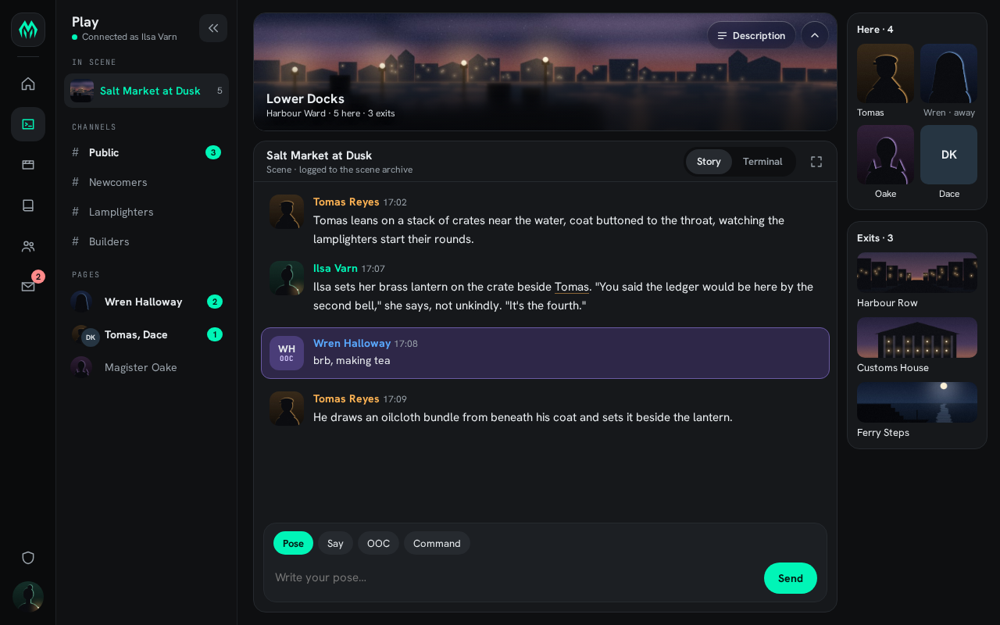
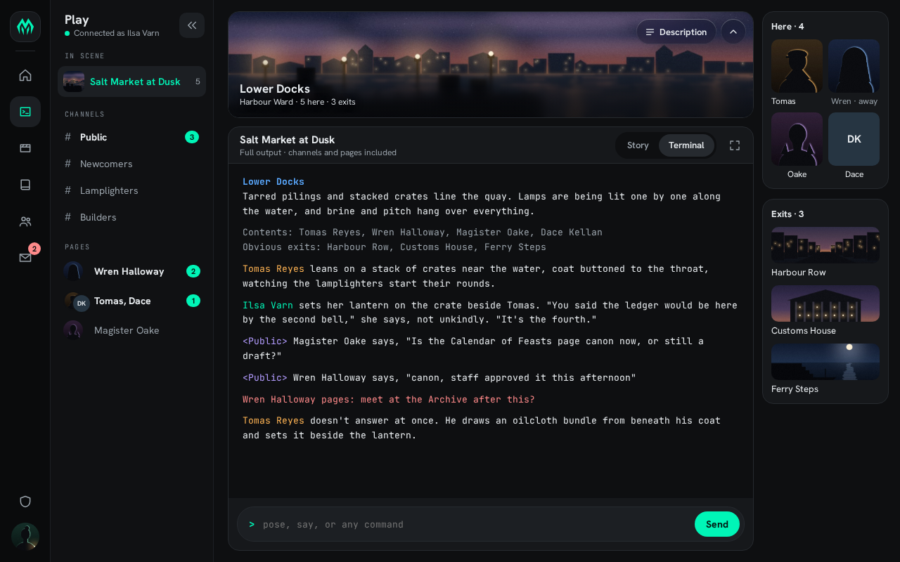

# D1 · Commons Dark — portal design handoff

**Status:** approved direction, ready to build. **Owner:** Harry.
**Source of truth:** the Design canvas "SharpMUSH Design Directions" (private link; ask Harry).
Everything needed to build is in this folder, so you do not need the canvas:

| Path | What it is |
|---|---|
| `README.md` | This spec: decisions, tokens, frame, kit, pages, data, phases, acceptance criteria, open questions |
| `tokens-d1.css` | The token additions and one change, written against `wwwroot/css/tokens.css` |
| `boards/*.png` | Screenshots of every D1 board and state (1× pixels), the visual reference. `07` predates the sample art, so its tiles are flat placeholders |
| `boards-src/*.dc.html` | The boards' markup. Inline styles give exact values. Prototype HTML, **not** production markup, and never copied as-is. `IMAGES.md` maps its `/_blob/…` image URLs to `samples/` |
| `samples/*.jpg` | Original placeholder art (rooms, portraits, banners), free to use as dev fixtures |

D1 restyles and restructures the existing Phosphor Refined portal; it is not a new design system. It keeps
the palette already in `tokens.css`, Hanken Grotesk, Cascadia Mono, and MudBlazor 9 as the only component
library. What it adds is **one page frame, images where the subject has one, and a small kit of shared
pieces** that Play introduced and every page reuses.

**Rules that still bind:** `CLAUDE.md` and `docs/design/ui-patterns.md` **§14** (the shell owns `@media`;
pages use `@container page` tiers of 48/64/90rem; no `!important`; no `position: fixed` in scoped CSS;
`ResponsiveConventionsTests` gates all of it) and **§15** (command palette). Ignore ui-patterns **§13**'s
token and preset description (`--sharp-*`, Catppuccin, DB-stored themes): it doesn't match the code. §2
below describes what actually exists. `CLAUDE.md`'s "IThemeService — DB-backed … CSS variables" line is
also stale, because the service is localStorage-backed and writes no CSS variables.

---

## 1. What the user decided (do not re-open)

1. **Object names in poses are plain text.** No chips, bubbles, links or icons inside pose text.
2. **Character names in prose** (poses, wiki, biographies) keep body colour and weight. The only cue is a
   1px underline in the character's name colour at 50% opacity, offset 3px (§4.8).
3. **No reference picker.** No `@` autocomplete and no "Reference" button in the composer.
4. **OOC is a message type, not a channel.** It is a composer type chip and a tinted band in the story (§4.10).
5. **No "Look" button in the room banner.** (The character sheet and exit preview keep their Look actions.)
6. **Glass is subtle.** A progressive blur plus a light scrim under the text only. No frosted panel, and the
   image stays visible (§4.3).
7. **Play's right column order:** Here (characters, then objects), then Exits.
8. **Pages can involve several people** (group pages), shown as stacked avatars (§5.1).
9. **The wiki has no "Places" category.** A room is a game object and can be anything, anywhere, with
   duplicates. The setting lives in a **Theme** category. Never map a wiki page to rooms ("live here").
10. **Softcode decides, the portal draws.** Status words, name colours, actions, locks and hints come from
    payloads. The client never invents them.

---

## 2. Tokens

`tokens-d1.css` lists the additions. Merge them into the `:root` block of `wwwroot/css/tokens.css`
(layer `tokens`). Existing tokens are unchanged except `--text-faint`.

| Token | Value | Status | Use |
|---|---|---|---|
| `--bg` `--surface` `--surface-2` `--surface-3` | `#0e0f11` `#16181b` `#1c1f23` `#101113` | existing | page · cards · raised (composer, active row) · page sidebar |
| `--rail-bg` | `#0a0b0c` | new | icon rail |
| `--border` / `--border-soft` | `#262a2f` / `#1d2024` | existing | |
| `--text` / `--text-dim` | `#e9edf0` / `#9aa3ab` | existing | |
| `--text-faint` | **`#7d8790`** (was `#5f6870`) | changed | labels, placeholders |
| `--accent` `--accent-dim` `--accent-on` `--glow` | | existing | |
| `--text-on-image` | `#d2d8dd` | new | secondary text over banner images |
| `--link-missing` | `#ff8a8a` | new | wiki redlinks |
| `--warn`, `--warn-tint` | `#ffb454`, `rgba(255,180,84,.14)` | new | "changed" badge, unsaved bar |
| `--unread-alert` | `#ff8a8a` | new | rail mail badge |
| `--ooc-band-bg` `--ooc-band-border` `--ooc-icon-bg` `--ooc-icon-fg` | see file | new | OOC band (§4.10) |
| `--glass-bg` `--glass-pill-bg` `--glass-filter` `--glass-edge` `--on-image-shadow` `--scrim` `--scrim-open` `--blur-mask-*` | see file | new | banner (§4.3) |
| `--radius-card` 16 · `--radius-row` 10 · `--radius-tile` 10 · `--radius-portrait` 12 | | new | (the 14px strip radius is the existing `--radius-lg`) |
| `--rail-w` 72 · `--side-w` 232 · `--side-strip-w` 62 · `--aside-w` 196 · `--main-pad` | | new | frame (§3) |
| `--mention-offset` 3px · `--mention-alpha` 50% | | new | §4.8 |

**Why `--text-faint` changes:** `#5f6870` is 3.38:1 on `--bg` and 3.13:1 on `--surface`, which fails WCAG AA
for the small labels it is used on. `#7d8790` is 5.24 / 4.86 / 4.52 on bg / surface / surface-2. Two
places hard-code the old value and need the same change: `ThemeService.cs` (`TextDisabled = "#5f6870"` in
`ToMudTheme`) and the fallback in `SharpMUSH.Contracts/Authorization/BuiltInRoles.cs`. Check each against
its own use.

**Accent presets don't reach the CSS variables yet (existing gap).** `ThemeService` presets (Phosphor
`#00f5b7`, Amber `#ffb454`, Violet `#b39cff`, Rose `#ff7a9c`, Signal `#5aa9ff`) change only the MudTheme
palette, so D1's plain-CSS chrome ignores them. When presets become selectable (`/settings/theme` is still
"coming soon"), have `ThemeProvider` also emit `--accent` (Primary), `--accent-dim` (Secondary), `--accent-on`
(OnAccent) and `--glow` (the RGB triple, which needs a small helper because `ParseHex` is private) from
`ThemeService.DeriveAccent`. Note that `DeriveAccent`'s on-accent is `rgb × 0.12`. For Phosphor that gives
`#001d15`, not today's `#03150f`, so emitting it changes `--accent-on` slightly. It still passes everywhere
(12.43 / 10.21 / 8.02 / 7.56 / 7.56 for the five presets). Don't hard-code `#00f5b7` in new CSS.

**Name colours are not the accent.** A character's colour comes from softcode and is independent of the
viewer's accent (§4.8, §7.5). `--warn` shares its hex with the Amber preset and a common name colour. That
is acceptable because none of them relies on colour alone.

**Fonts:** the boards use JetBrains Mono for small caps labels. In the app use `--font-mono` (Cascadia
Mono). No new fonts.

### Contrast (verified)

WCAG 2.x formula. Banner figures were measured against the rendered sample images with text shadows
removed.

| Pair | Ratio |
|---|---|
| text on bg / surface / surface-2 / OOC band | 16.29 / 15.11 / 14.05 / 11.89 |
| text-dim on bg / surface-3 / surface / surface-2 | 7.49 / 7.38 / 6.95 / 6.46 |
| text-faint (new) on bg / surface-3 / surface / surface-2 | 5.24 / 5.16 / 4.86 / 4.52 |
| accent on surface-3 / surface / surface-2 · accent-dim on surface | 13.26 / 12.49 / 11.61 · 7.49 |
| derived on-accent on each preset (Phosphor / Amber / Violet / Rose / Signal) | 12.43 / 10.21 / 8.02 / 7.56 / 7.56 |
| warn on surface / on warn-tint over surface | 10.09 / 7.55 |
| OOC label on OOC icon tile · redlink on surface | 6.12 · 7.84 |
| text over banner images, every board and state | lowest 8.87 (wiki home hero); Play lowest 9.28 (minimised strip) |

Banner contrast depends on the image. The §4.3 scrim keeps light text above 4.5:1 on bright art, so don't
lighten it without re-measuring. Text dimmed behind a modal (the character sheet) is inactive and exempt.

---

## 3. The frame (every page)


```
┌──────┬──────────────┬─────────────── .phosphor-page (container: page) ───────┐
│ rail │ page sidebar │  main                                    │ aside     │
│ 72   │ 232  (62)    │  banner (only if the subject has image)  │ 196       │
│      │ shell slot   │  main card(s)                            │ page-owned│
│      │              │  bottom bar (only if the page takes input│ cards     │
└──────┴──────────────┴──────────────────────────────────────────┴───────────┘
```

- **Rail** (72px, `--rail-bg`, shell): logo, then section icons (Home, Play, Scenes, Wiki, Characters,
  Mail with an unread badge), a spacer, then **Build & manage** (the shield, labelled "Staff tools" on the
  boards) and the account avatar. Active item: `--surface-2` fill and accent icon, 44×44px, radius 14.
- **Page sidebar** (232px, `--surface-3`, **a shell slot** the page fills, for example with Blazor
  `SectionOutlet`/`SectionContent`): title (18px/700) and a one-line status, then a **collapse button at
  the top right** (36×36, radius 10, `--surface-2`). Collapsed, it becomes a 62px strip that keeps each
  row's image, avatar or icon (40–44px, current item ringed in accent), so it stays usable. The boards
  draw 64px, but keep today's 62. Remember the state (Q3). Pages without sub-navigation render no sidebar.
- **Main + aside live inside `.phosphor-page`** and are laid out by the page. This matters because at
  1280px with the sidebar open the container is 976px (1280 − 72 − 232). That is the **medium** tier
  (below 64rem) but above narrow. A shell-owned 196px aside would push every page to 748px, below 48rem,
  so every page would sit in its narrow tier at the design size. Rules:
  - At the medium tier, keep the side-by-side layout shown on the boards.
  - At the narrow tier (below 48rem), stack the aside under main (Play: see §5.9).
  - The main column uses `--main-pad` and a 12px gap. The aside is 196px wide with 14px gaps: a stack of
    cards titled "Label · count".
  - Check existing page stylesheets' medium and narrow blocks, because they will now apply at desktop
    sizes (for example `ConfigIndex.razor.css` shrinks its title in the narrow tier).
- **Layout zones:** where a page's layout scope has a `RightSidebar` zone, the aside renders that zone
  **inside the page** (as `CharacterProfile.razor` already does with `ScopedZone … RightSidebar` in its
  grid). Today only `profile` has one. `home` and `wiki-index` are MainContent-only (`LayoutScopes.All`),
  so the wiki home needs `wiki-index` to gain a `RightSidebar` zone (§6.1). Other pages (wiki page, config)
  render their aside as page markup.
- **The global scope's zones** (TopBar, LeftSidebar, RightSidebar, Footer; `MainLayout.razor`,
  `phosphor-widget-aside`) are admin features and must keep working. The desktop top bar goes away in
  D1, and the default global layout places **QuickLinks** in TopBar, so Q1 decides where TopBar content goes.
- **Mobile (≤760px or coarse pointer):** unchanged model. The off-canvas drawer and bottom tab bar replace
  the rail, the page sidebar folds into the drawer, the aside stacks, and touch targets are 44px (shell
  rules).

### Navigation mapping (`Layout/NavMenu.razor`)

`NavMenu`'s labelled groups become the rail plus section sidebars:

| Today | D1 |
|---|---|
| Play group: Home, Play, Scene archive, Mail (only while `_characterActive`) | rail: Home, Play, Scenes, Mail (same gate) |
| World group: Wiki, Characters, Help | rail: Wiki, Characters. Help per Q2 |
| Build group and Manage group | the **Build & manage** section. Its page sidebar lists the same items with the **same gates**, which are policies, fallback pairs (`queue.inspect` → `queue.inspect.own`, `jobs.manage.own` → `jobs.manage`) and the Snapshots claim check (`perm` `snapshots.capture`/`restore`). The rail item appears only when at least one item is visible (`softcode.use` counts) |
| `ApplicationNavLinks` per section, and novel sections | apps appear under "Apps" in their section's sidebar. A novel section gets a rail item using the icon of its lowest-`Order` app |

Inside Build & manage, pages with their own sub-navigation replace the section sidebar with theirs. On
`/admin/config/*` the sidebar is the Config tree (§6.4), with a "‹ Build & manage" row at the top to go back.

---

## 4. The kit

Build these once (for example under `SharpMUSH.Client/Components/Kit/`), each with a scoped stylesheet and
bUnit tests. Exact values are in `boards-src/`. The important numbers are below.

### 4.1 Section label
Mono (`--font-mono`), 10px, uppercase, `--text-faint`, padding `0 10px 6px`, letter-spacing .12em. The
existing `.section-kicker` uses .16em. Keep it as it is and add a sidebar variant, rather than changing
every existing kicker.

### 4.2 Sidebar row
One shape, with the lead changing by content:

| Lead | Row height | Example |
|---|---|---|
| 30px image, radius 8 | 44 | scene, wiki category |
| 28px round avatar (two stacked 24px for a group page) | 40 | pages, online characters |
| 28–30px icon tile (`--surface-2`, radius 8, dim icon) | 36–44 | config groups, browse links |
| `#` in mono, faint | 36 | chat channels |

Padding `0 8px`, gap 8, radius 10. Current item: `--surface-2` fill, accent text, weight 600, and
`aria-current="page"`. Right slot: a dim count (12px), or an unread pill (18px tall, radius 9, accent fill,
`--accent-on` 11px text). A row with unread items is bold (700) in `--text`, and a quiet row is `--text-dim`.

### 4.3 Glass banner
Only when the subject has an image: a room (Play), a wiki page with `Article.Image`, or a character banner.
Otherwise use the plain header (§4.9).
- Card: radius 16, 1px `--border`, `overflow: hidden`, image `object-fit: cover` (honour `focal` when given).
- **Progressive blur:** three stacked `backdrop-filter` layers, each masked from the bottom:
  `blur(2px)` + `--blur-mask-soft`, `blur(6px)` + `--blur-mask-mid`, and `blur(12px)` + `--blur-mask-deep`.
  Then add the `--scrim` gradient.
- **Description open** (Play only): the banner goes from 150 to 200px and uses the `*-open` masks and `--scrim-open`.
- Text bottom-left, inset 16px, with `--on-image-shadow`. Title in `--text` (17px/700 in Play, 26–28px on
  page heroes), secondary lines in `--text-on-image` (12–13px), and an optional mono kicker.
- **Capsule buttons** top-right (Back sits top-left): 36px tall, radius 18, `--glass-bg` +
  `--glass-filter` + `--glass-edge`. The page's one primary action (Edit, Page, New page) and a pressed
  toggle (Description) use solid accent with `--accent-on` text. Icon-only capsules are 36×36 with an
  `aria-label`.
- **Minimise** (chevron-up) collapses to a 48px strip (radius `--radius-lg`) showing the image, a
  left-weighted blur and gradient, the title and one fact, and a chevron-down to restore.
- Heights: Play 150 (200 with the description open), wiki page 200, wiki home hero 180, character 236.

### 4.4 Card and card header
`--surface`, 1px `--border`, radius 16, padding 12 (aside) or 0 with a 52px header row (main). Card title
is 13px/700. Header row: a 15px/700 title and a 12px dim sub-line, with controls at the right.

### 4.5 Portrait tile
People in a 2-column grid: image `width: 100%`, 64–76px tall, radius 10, `object-fit: cover`, label 12px
below. No image: initials on a tinted fill at the same size, so the grid never jumps. A dim label means
away or idle ("Wren · away"), and the word comes from softcode.

### 4.6 Image tile
Rooms, exits, pages and scenes: full-width image 52px tall (76 on category covers), radius 10, label 13px
with an optional right-aligned dim count. No image: `--surface-2` fill with a centred icon.

### 4.7 Pill (on images)
26px tall, radius 13, `--glass-pill-bg` + glass, 12px text, and an optional 7px status dot. Used for "In
a scene · Salt Market at Dusk", "Idle 1m" and "#312".

### 4.8 Name mention
```css
.mention { color: inherit; font-weight: inherit;
  text-decoration: underline 1px color-mix(in srgb, var(--name, var(--text-faint)) var(--mention-alpha), transparent);
  text-underline-offset: var(--mention-offset); }
```
- `--name` is the character's colour when the client knows it (Play payloads, §7.1; elsewhere §7.5). The
  viewer's own name uses `--accent`. With no colour, the underline falls back to the neutral faint colour,
  never the accent.
- A mention is a link. In Play it opens the **character sheet drawer** (the player stays in the scene);
  everywhere else it opens `/character/{Name}`.
- **Wiki pages:** `/character/` links (`WikiDisplay.FindLinkTargets` already finds them) render as mentions.
- **Poses:** underline the names of the scene's *other* participants, matched whole-word against the cast.
  Don't underline the actor's own name at the start of the pose.
- **Other links:** wiki links change from today's `--mud-palette-secondary` (`shell.css`, `.WikiContent …
  a`) to `--accent`, as on the boards. Redlinks (`.wiki-redlink`, from `WikiDisplay.MarkRedlinksAsync`)
  change colour from `--mud-palette-error` to `--link-missing`, keeping their 1px dashed border.
- Objects are plain text (decision 1).

### 4.9 Plain page header (no image)
Mono kicker (faint), 26px/700 title, 13px dim description, actions aligned right on the baseline. Used by
Config and by wiki pages without an image.

### 4.10 OOC band (Play story)
Row background `--ooc-band-bg`, 1px `--ooc-band-border`, radius 12, pulled out 11px on both sides so the
text stays aligned with pose text. In place of the portrait: a 44×44 tile (`--ooc-icon-bg`, radius 12)
showing the author's initials (13px/700) above "OOC" (mono 9px/700, .08em, `--ooc-icon-fg`). The name is
in its colour and the text is 14px. It needs poses to carry an OOC marker (§7.2).

### 4.11 Bottom bar
One shape for the Play composer and the Config unsaved bar: `--surface-2`, 1px `--border`, radius 16,
padding `10px 12px`, at the bottom of main. Use `position: sticky` or flex layout, not `fixed` (scoped CSS
may not use fixed).
- **Composer:** message-type chips (30px, radius 15, the selected one in accent fill), **Pose · Say · OOC ·
  Command**, then the input (40px, 15px text) and **Send** (40px, radius 20, accent, 700). Terminal view
  uses a single mono input with a `>` prompt.
- **Unsaved bar:** a warn icon, "**Unsaved changes** in this section", a warn-tint count chip ("1 change"),
  then **Reset changes** and **Save configuration** (accent). It only appears when something changed.

Solid accent is kept for the primary action and the current choice. Don't use it decoratively.

### 4.12 Overlays
The character sheet drawer, the portrait viewer and the mobile Room sheet are overlays. Build them with
MudBlazor (`MudDrawer` / `MudDialog` / `MudOverlay`) or shell-level CSS, not `position: fixed` in a page's
scoped stylesheet (`ResponsiveConventionsTests.NoScopedStylesheetPositionsAnythingFixed`).

---

## 5. Play

Boards `01`–`13`. Files today: `Pages/Play.razor` (+ `.razor.css`), `Components/GlobalTerminal.razor`,
`Services/OobChannelStore.cs`, `Services/OobEntryParser.cs`, `Pages/SceneLive.razor` (scene hub
consumer), `Components/ScenePoseLine.razor`.

| | |
|---|---|
|  |  |
| In scene, Story view | Terminal view |

### 5.1 Page sidebar
Title "Play" and "● Connected as {character}". Groups:
- **In scene**: the current scene as an image row (room image) with its participant count.
- **Channels**: `#` rows with an unread pill, bold when unread. Clicking opens the channel view in main
  (board `06`: a Discord-style list with day dividers and a "New" divider).
- **Pages**: one row per conversation, with an avatar (a stacked pair for a group page), the names and an
  unread pill.
- Collapsed (board `07`): the scene image, channel tiles with badges, and page avatars.

The data for channels and pages is §7.3 (Q4).

### 5.2 Room banner
From `room.info` (§7.1): the image, the name, and "area · N here · N exits". Capsules: **Description** (a
toggle that shows the description over the image; banner 150→200px) and **Minimise**. No Look button.

### 5.3 Scene card header and view switch
Title (the scene title, else the room name) and a sub-line: "Scene · logged to the scene archive" in Story,
"Full output · channels and pages included" in Terminal. Then a segmented **Story | Terminal** switch
(`role="radiogroup"`) and a **focus mode** icon button in the header. Today focus mode is an item inside
the terminal settings `MudMenu` and hides only `.play-side` and the terminal chrome (`Play.razor.css`). In
D1 it becomes the header button and also hides the page sidebar and the banner. Keep the settings menu
for its other items (width, clear).

### 5.4 Story view (only while in a scene)
One row per pose: a 44px portrait (radius 12), the name in its colour (700) and the time (12px dim), and
the pose text at 15px/1.6. OOC poses use the band (§4.10). Other participants' names are mentions (§4.8).
Objects stay plain. Outside a scene there is no Story view, and Terminal shows the raw stream. The source
is the scene hub's `SceneEventMessage` (as `SceneLive.razor` uses it). Play has no scene wiring today; it
learns the current scene from `room.info.scene` (§7.1).

### 5.5 Terminal view
The existing `GlobalTerminal`. D1 only changes the chrome around it.

### 5.6 Here and Exits (aside), in that order
- **Here · N**: portrait tiles, characters first, then objects (square thumbnails). Clicking a character
  with `profile: true` opens the sheet; clicking an object runs its `cmd`.
- **Exits · N**: image tiles from `dest.image`, falling back to an icon tile. The states (board `10`):
  - **open**
  - **occupied**: a count, never names
  - **locked**: still listed, with the softcode `hint`
  - **closed door**: its action comes from softcode
  - **leaves the scene**: confirm first, using the payload's `confirm` text
  - **no image**

  Dark exits are never sent. A keycap shows the first alias, and pressing that key goes. Alias keys never
  fire while focus is in a text input. Hover or focus shows a preview (description, "N there", Go, Look).
- Today these are inline markup in `Play.razor`. Extract them into components, and into widgets once the
  play scope exists (§7.4).
- **Quick actions** (Characters, Mail, Scene archive, Help) is dropped. Its links live in the rail (Help
  per Q2).

### 5.7 Character sheet drawer (board `08`)
An overlay from the right. It shows a full-height portrait with **Full image** (which opens the portrait
viewer, board `09`), then the name, the role line, pills (in scene, idle, dbref), and the actions **Look ·
Page · Mail · Profile** (Profile goes to `/character/{Name}`). Below that are a short description, the Details
(the profile schema rendered compact) and a gallery strip. Data: `GET http/profile/schema` and
`http/profile?objid=…` (the profile-handler package), plus the gallery (`GalleryItem.IsIcon` marks the
portrait). What the profile endpoint doesn't return yet is covered in §7.5.

### 5.8 Composer
§4.11. The types map to commands (pose / say / OOC / raw command). No reference picker. OOC sends the
game's OOC command, and the pose must come back marked OOC (§7.2).

### 5.9 Mobile (board `11`)
A compact banner, then Story. Here and Exits move into a bottom **Room** sheet with exits as rows showing
keycaps. The bottom tabs are **Scene · Room · #Channels · Pages**, with unread badges on the last two. The
global bottom nav stays suppressed on `/play` as today, and these tabs are Play's own.

---

## 6. Other pages

### 6.1 Wiki home `/wiki` (boards `21`, `22`)
`Pages/WikiIndex.razor` composes the `wiki-index` scope, and its default layout is one `WikiIndex` widget.
- Restyle `Components/Widgets/WikiIndexWidget.razor`. Its hero copy ("{AppTitle} · World Wiki",
  "Everything you need to play", the blurb, "Search the wiki…", `locked`, `draft`, the empty states) is
  hard-coded English today. **Move it into `SharedResource.resx`** while restyling.
- The hero is a glass banner with a glass search field and a **New page** capsule (`wiki.create`).
- **Category cards** (3 columns at the medium tier, 2 below 48rem): a 76px cover image (§7.5), the name and
  count, the top 3 pages with `draft`/`locked` tags (from `Published` / `IsProtected`), and "All N pages".
  With no image, show an icon cover. The categories on the boards are samples (Theme, Organizations, Houses,
  Lore, Events, Policy).
- Aside: give `wiki-index` a **`RightSidebar`** zone (in `LayoutScopes.All` and `GetDefaultLayout`) with
  **RecentWikiActivity** (today placed on the home scope) and **ActiveScene** ("Live now", which is not tied
  to categories). Restyle both widgets as aside cards.
- Page sidebar: "Wiki · Main namespace · N pages", search, **Browse** (Wiki home, Recent changes),
  **Categories** (image rows with counts), and a dashed **New page** button at the bottom (`wiki.create`).

### 6.2 Wiki page `/wiki/{ns}/{category}/{slug}` (boards `23`, `24`)
`Components/WikiDisplay.razor`, the non-hero branch. **The same branch also renders the embedded
biography on profiles** (`WikiBodyWidget` → `WikiView Embedded=true` → `WikiDisplay`). Gate the banner,
the page sidebar and the aside on `!Embedded`.
- With `Article.Image`: a glass banner with the kicker (category), the title, "Last edited by {mention} ·
  when · anyone can edit" (data: §7.5), **Back to Wiki** top-left, and **History**, **Edit** (primary,
  `wiki.edit`) and Minimise top-right. **Remove the in-body `wiki-img`** when the banner shows it, so it
  doesn't appear twice. Without an image, use the plain header (§4.9) with the same content.
- Body card: max 640px measure, 15px/1.7, h2 18px, with mentions, links and redlinks per §4.8. Keep the
  locale banner, history and edit.
- Aside (page markup):
  - **On this page**: the TOC from `BuildToc`, current section in accent with a 2px left rule. Move it out
    of the component's current `.wiki-toc` column. The locale links go under it.
  - **Mentioned · N**: portrait tiles for the characters the page links to.
  - **More in {category}**.

### 6.3 Character profile `/character/{Name}` (boards `25`, `26`)
`Pages/CharacterProfile.razor` and the `profile` scope: the character-header application and WikiBody in
MainContent, CharacterGallery in RightSidebar (already rendered inside the page).
- Page sidebar: "Characters · ● N online · N characters", search, **Online now** (avatars with a softcode
  status word), **Your characters** (plus Create a character) and **Browse** (All characters, Recently
  approved).
- Banner (236px): the banner image (§7.5), falling back to today's hue gradient.
  - Bottom-left: a 104px portrait (radius 18), the name in the character's colour (28px/700), the role line
    and pills (in a scene → Play, idle, dbref).
  - Bottom-right: **Mail** (glass) and **Page** (primary). Top-right: **Full image** (the portrait viewer).
- Main: **Details** (the character-header schema widget as a 4-column key/value grid), then
  **Biography** (WikiBody, with a "Wiki page · edited …" header and History).
- Aside (the `RightSidebar` zone): **Gallery · N** (the profile image large with a star badge, the others as
  small tiles, View all → viewer), plus **Recent scenes** and **Often plays with** (new widgets, §7.5).

### 6.4 Server configuration `/admin/config`, `/admin/config/{category}` (boards `27`–`29`)
Files: `Pages/Admin/Config/ConfigIndex.razor`, `DynamicConfig.razor`, `Components/ConfigNavDrawer.razor`,
`Layout/ConfigLayout.razor`.

**Page sidebar** (replaces `ConfigLayout`'s section nav):
- Header: "Configuration · Admin · server settings".
- **Settings**: a tree of the six groups (icon tile and chevron). The open group expands into its sections
  as indented rows with setting counts, and the current section is in accent.
- **Maintenance** (Import, Export) is pinned to the bottom.
- Collapsed: the group icons.

**Home:**
- Plain header: "Admin · server configuration", "Server configuration", "Manage all SharpMUSH server
  settings from one place".
- 2-column grid of group cards. Each has an accent icon tile, the name, "N settings", an **Important** warn
  tag on Security, the description, and section chips (4 shown, then "+N more").
- Aside: **More admin tools** and **How changes apply**.

**Section:**
- Plain header with **Reset to defaults**.
- Each group is a section label above a card of rows. A row has:
  - the name (14px/600), with its key next to it in faint mono (`Chat.ChatTokenAlias`),
  - a **changed** warn badge after an edit, and 13px dim help text below.
- The control sits on the right:
  - **switch**: 44×24. On: accent track, dark knob. Off: `#262a2f` track, `#c3cad0` knob (the knob carries the
    non-text contrast).
  - **numeric**: 112px, mono, right-aligned, with the `min–max` range in faint mono before it.
  - **text**: full-width. It can be narrow (56px, centred) when `Pattern` is `^.$`, because there's no
    schema flag for single characters.
  - **select**: pills. **stringlist**: chips.
- The unsaved bar (§4.11) replaces today's `MudPaper` save bar.
- Aside: **In this section** (group TOC with counts) and **Related**.

**Bug to fix in the same PR:** `ConfigIndex.GroupCategories["Content"]` is Message/Cosmetic/Chat, but
`ConfigNavDrawer` lists Wiki under Content, so the card counts 45 settings where the Content sections
total 46. Add `"Wiki"`. The card will then read 46; board `27` shows the old 45.

### 6.5 Home and everything else
There's no dedicated D1 board beyond the early `30-home-commons-dark.png` and `31-home-mobile.png`. Apply the
frame and kit. The home scope stays admin-composed, and its widgets adopt cards, tiles and section labels.
Settings, Mail, Scenes, Help and Admin follow the same rules: a page sidebar where they have
sub-navigation, the plain header, and cards.

---

## 7. Data and contracts

### 7.1 Room payloads, OOB v2 (board `12`)
The `room-contents` package pushes these (`examples/packages/room-contents`, `` ROOM`CONTENTS ``, the
`` FN`WHOVIS `` / `` FN`WHOROW `` / `` FN`EXITROW `` seams) with `oob(<targets>, <package>, <json>)`.
- Every payload carries `"v": 2` and is **additive**: `OobEntryParser` reads only `dbref`, `name` and
  `cmd` today and ignores the rest, so v2 doesn't break the current page.
- Send whole lists, not diffs.
- Images are references (URL, `alt`, `width`, `height`, optional `focal`), never inline data.
- Use `objid` for identity so caches survive a recycled dbref.
- **Per-viewer content:** today's handler builds one JSON and sends it to all of `lcon(%0)`. Privacy by
  omission (dark exits, per-viewer lock hints) needs a per-target loop in softcode. That is v2 package work.

```jsonc
// room.info (NEW): on arrival, and when the name, image or description changes
{ "v": 2, "dbref": "#1201", "objid": "#1201:1719500000", "name": "Lower Docks", "area": "Harbour Ward",
  "image": { "url": "/assets/rooms/1201.jpg", "alt": "The quay at dusk", "width": 1600, "height": 440, "focal": [0.5, 0.6] },
  "desc": { "format": "markdown", "text": "Tarred pilings and stacked…" },
  "scene": { "id": "42", "title": "Salt Market at Dusk", "cast": 5 } }

// room.contents (EXTENDED): rows gain identity, type, colour, image, status and actions
{ "v": 2, "who": [
  { "dbref": "#312", "objid": "#312:1718000000", "type": "player", "name": "Tomas Reyes", "color": "#ffb454",
    "image": { "url": "/assets/chars/312.jpg", "alt": "Tomas Reyes" },
    "status": "active", "idle": 60, "profile": true, "cmd": "look #312",
    "actions": [ { "label": "Page", "cmd": "page #312=" } ] },
  { "dbref": "#1142", "type": "thing", "name": "Oilcloth bundle", "image": { "url": "/assets/obj/1142.jpg" }, "cmd": "look #1142" } ] }

// room.exits (EXTENDED): v1 rows have only name/cmd; v2 adds dbref, aliases, state, hint, confirm, destination
{ "v": 2, "exits": [
  { "dbref": "#1210", "name": "Harbour Row", "aliases": ["n", "north"], "cmd": "goto #1210", "state": "open",
    "dest": { "name": "Harbour Row", "area": "Harbour Ward", "image": { "url": "/assets/rooms/1210.jpg" }, "desc": "A lamplit street of…", "here": 2 } },
  { "dbref": "#1211", "name": "Customs House", "aliases": ["w"], "state": "locked", "hint": "Closed after dusk" },
  { "dbref": "#1212", "name": "Ferry Steps", "aliases": ["e"], "cmd": "goto #1212", "confirm": "This leaves the scene." } ] }
```
- `state` is `open | locked | closed`.
- `scene.id` is a string, matching `SceneEventMessage.SceneId`. Board `12` shows a number; the string is
  correct.
- `scene.cast` supplies the sidebar's participant count, because `SceneSummary` has none.

### 7.2 Scene events
- **Portraits in Story:** add `ActorObjId` to `SceneEventMessage`.
  - The plugin only has `ScenePose.AuthorDbref`, and `ActorName` is the display name, so resolve the objid
    at broadcast time.
  - There are two positional-record copies (`SharpMUSH.Plugins.Scene/Models/SceneEventMessage.cs` and
    `SharpMUSH.Client/Models/SceneEventMessage.cs`). The client copy must mirror the wire shape exactly,
    including property order.
  - **Append** the field to both, then update every constructor call site (two in `SceneBroadcast.cs`, two in
    `SharpMUSH.Tests.BUnit/Components/SceneSurfaceTests.cs`) and any JSON contract tests.
- **OOC marker:** `Tags` are opaque, and nothing produces an `"ooc"` tag today. The Scene plugin must tag
  poses made with the game's OOC command (the composer's OOC type sends that command). The band keys off
  that tag.

### 7.3 Channels and pages (not designed as payloads yet)
Nothing structured feeds the Play sidebar's Channels and Pages today; they arrive only as terminal text.
The proposal needs Harry's call (Q4): two OOB packages following §7.1's rules.
- `comm.channels`: the list with unread counts, pushed on change.
- `comm.message`: one message, with `kind: "channel" | "page"`, `to`, `from` + `objid`, `text` and `ts`.

Until then, build the sidebar against an interface with an empty implementation. Terminal stays the full
stream.

### 7.4 Play as a layout scope (board `13`)
- Add `LayoutScopes.Play` (`"play"`, zones: RightSidebar) to `LayoutScopes.All` and `GetDefaultLayout`, with
  new **Here** and **Exits** widgets (they don't exist yet). Register them per `CLAUDE.md`'s widget steps.
- Proposed optional registry fields: `scope` (`"play"`) and `oob_package`. A Play widget subscribes to that
  package in `OobChannelStore` and renders the payload as `SchemaData`.
- Page apps with `NavPlacement: "Play"` are also listed under "Apps" at the foot of the Play sidebar.

### 7.5 Data the other pages need

| Need | Today | Change |
|---|---|---|
| Wiki page banner image | `WikiArticle.Image` | none |
| "Last edited by X · when" (wiki page, biography header) | `WikiArticle` has no editor or time; revisions carry `EditorDbref` (history page) | expose the latest revision's editor (name) and time with the article |
| Recently changed: who, when, thumbnail | `WikiPageSummary` has `UpdatedAt`, no editor, no image | add the editor name and image to the summary |
| Category cover image | none | an image per category (for example from the category's index page) with the page list |
| Character name colour, role line, idle, current scene (profile, drawer, mentions outside Play) | `GET http/profile` returns only character, objid, dbref and `fields{created, objid}` | profile-handler fields (softcode-defined, like everything else). Colour becomes a known field the client caches by character |
| Character banner | profile shows a hue gradient | a gallery flag like `IsIcon`, for example `IsBanner` (at most one), with the gradient as fallback (Q5) |
| Recent scenes by character | the scenes API has no participant filter | a participant filter, plus a profile widget |
| Often plays with | none | derived from shared scene participation, as a profile widget |

---

## 8. Build order (one PR each)

Each phase ships on its own with bUnit tests, `ResponsiveConventionsTests` green, and screenshots compared
against `boards/`.

0. **Tokens + kit.** Merge `tokens-d1.css` (and update `TextDisabled`). Build the §4 components with tests,
   with no page changes. A staff-only kit preview page is optional.
1. **Shell.** Resolve Q1–Q3 first. Build the rail, the page-sidebar slot, collapse and the collapsed strip,
   the navigation mapping (§3) with its gates unchanged, global zones still working, and mobile parity.
2. **Config.** The sidebar tree, `ConfigIndex` cards, `DynamicConfig` rows and the unsaved bar, and the
   Content count fix. It's the smallest page and needs no new data, so it proves the kit and the tier
   behaviour.
3. **Wiki.** `WikiIndexWidget` (+ resx copy), the `wiki-index` `RightSidebar` zone with RecentWikiActivity
   and ActiveScene, and `WikiDisplay` (banner, mentions, redlinks, aside, `!Embedded` gating). New data
   from §7.5 renders when it becomes available.
4. **Character profile.** Banner (gradient fallback), Details, Biography and the Gallery aside card. The new
   widgets and fields follow their data.
5. **Play data.** `room-contents` v2 with `room.info` (scene id and cast), per-viewer rows, `OobEntryParser`
   v2 fields, `SceneEventMessage.ActorObjId`, and the OOC tag.
6. **Play UI.** The frame, banner, Story/Terminal, the focus button, the Here/Exits components with every
   exit state and fallbacks, the sheet drawer and portrait viewer, the composer and mobile. Remove Quick
   actions.
7. **Play scope, channels and pages.** `LayoutScopes.Play` with the Here and Exits widgets, and Q4's
   packages.

## 9. Acceptance criteria (every phase)

- **Visual match:** matches the relevant `boards/` screenshots at 1280×800 (layout, spacing, radii,
  colours). Differences caused by data are fine; structural ones are not.
- **Contrast:** WCAG AA. Text ≥4.5:1 (≥3:1 at 24px and above); UI boundaries and states ≥3:1. Re-check banner
  text on a bright test image.
- **Semantics:**
  - real `<button>`, `<a href>` and `<input>` with labels; icon-only controls have an `aria-label`;
  - toggles expose `aria-pressed` or `aria-expanded`;
  - the view switch is a `role="radiogroup"`, and current items carry `aria-current`.
- **Keyboard:** everything is reachable by keyboard, and exit alias keys never fire while typing.
- **Target size:** targets ≥24px (WCAG 2.2 AA) everywhere, and ≥44px under `(pointer: coarse)` (shell rule).
- **Motion:** use the `--motion-*` tokens for collapse and minimise, so reduced motion zeroes them.
- **Copy:** all new copy goes through `IStringLocalizer<SharedResource>`, and existing hard-coded strings you
  touch move into resx.
- **Libraries:** no new UI dependency. MudBlazor components are fine where they fit.
- **Responsive rules:** `docs/design/ui-patterns.md` §14 holds, and pages keep a sane layout at the
  medium and narrow tiers.

## 10. Open questions for Harry (ask; don't guess)

- **Q1** With the desktop top bar gone, where do **omnisearch (⌘K)**, the **language picker**, the **terminal
  toggle**, the page title and the global **TopBar** widget zone (QuickLinks by default) go? Proposal:
  - a search icon at the top of the rail that opens the command palette (§15);
  - the language picker in the account menu;
  - the terminal toggle at the bottom of the rail;
  - no page title (the page sidebar and banner name the page);
  - the TopBar zone as a slim strip above main, only when an admin puts widgets in it.
- **Q2** **Help** has no rail icon on the boards. A rail item, or under Wiki's Browse group?
- **Q3** Remember the sidebar collapse per section or globally? (Proposal: per section, in localStorage like
  the theme preset.)
- **Q4** Channels and pages data (§7.3): packages as proposed, or another route?
- **Q5** Character banner: a separate gallery flag, or pick a wide gallery image automatically?
