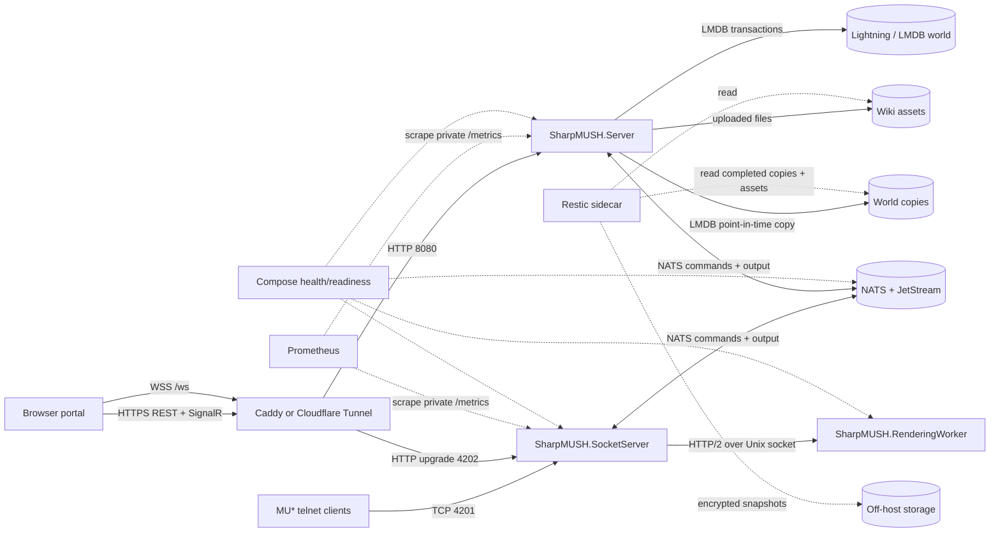

# Deployment architecture

This is the supported single-host production shape in `deploy/`. Arrows label the protocol or persisted-data flow; dashed arrows are observation or backup flows.

## Ownership and failure boundaries

| Component | Owns | Restart effect | Health signal | Backup coverage |
| --- | --- | --- | --- | --- |
| Caddy or Cloudflare Tunnel | Public web ingress and TLS path | Browser REST, SignalR, and WebSocket ingress pauses; telnet is separate | Proxy/tunnel status plus end-to-end HTTPS and `/ws` probes | Configuration and secrets management; no world state |
| `SharpMUSH.Server` | Engine, REST, SignalR, portal files, account/session decisions, LMDB writer, wiki assets | Engine-hosted HTTP/SignalR connections restart; SocketServer can keep client sockets and reconcile when the engine returns | Readiness/health, logs, server metrics, command/login probes | Point-in-time LMDB copies, wiki assets, deployment configuration |
| `SharpMUSH.SocketServer` | Public telnet/WebSocket kernel sockets and connection/session gateway | Existing sockets close; WebSocket recovery is bounded, ordinary telnet reconnects | Service health, public telnet and `/ws` probes, socket metrics | NATS recovery data may restore a logical WebSocket session, never the terminated socket |
| `SharpMUSH.RenderingWorker` | Stateless client-format rendering behind a private Unix socket | Sockets remain owned by SocketServer; output waits/retries while rendering is unavailable | HTTP/2 Unix-socket health checked by SocketServer | Image/configuration only; no persistent game state |
| NATS with JetStream | Inter-service messages plus bounded replay/resume state | Engine/gateway coordination and recovery degrade; world data remains in LMDB | NATS health, logs, stream limits and volume status | Persistent NATS volume if replay/resume continuity is required |
| Lightning/LMDB | Authoritative MUSH world in the server's app-data volume | Server cannot operate without it | `@storage`, storage metrics, server readiness, LMDB errors | Only completed `@backup` point-in-time copies; never a live-file read |
| Wiki asset storage | Uploaded binary assets outside LMDB | Wiki metadata may remain while files are missing | Portal asset fetch and inventory checks | Direct Restic snapshot of the asset directory |
| Restic and off-host storage | Encrypted recovery copies away from the host | No runtime impact until recovery is needed | Scheduled-job result, repository check, restore drill | Contains selected completed world copies, assets, plugins, and config—not live process state |

The socket-preservation and recovery details, including update impact and token/replay limits, are maintained in [`deploy/connection-updates.md`](../../deploy/connection-updates.md). Backup commands, storage estimates, retention, and the restore drill are maintained in [`deploy/README.md`](../../deploy/README.md).
