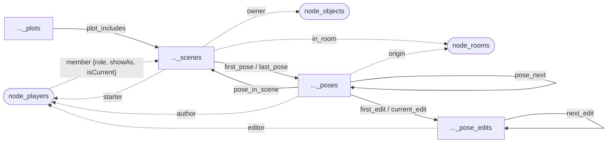

# Scene System — Detailed Design

> **Reconciled 2026-06-19** — This document supersedes all earlier scene-system
> prose. It is a **graph-native** design (the engine ships wizard-only
> primitives; capture / permission / formatting / room-orchestration policy
> lives in softcode). Key shape: entities are vertices joined by edges (not
> FK-by-property); references to game objects are **edges to the real object
> vertices plus a `Name` snapshot** (so a deleted object still renders); pose
> order is a `NEXT` linked list; pose content is versioned in `pose_edit`
> vertices with a `current_edit` pointer; there is **no `ActRole`** (a pose
> carries an opaque `ShowAsName`); there are **no `SCENE`*` attributes** on game
> objects. It supersedes the engine-scene-logger and web-routing prose in
> architectural-decisions.md §7.

## Overview

A *scene* is an ordered transcript of *poses* set in a room, optionally grouped
under a *plot*, with role-distinguished membership (an edge per player), opaque
per-pose tagging, full pose editing (versioned content with undo/redo/move/
delete), scheduling, temporary rooms, and a live portal feed.

The engine never decides *when* a pose is captured, *who* may start/stop/share a
scene, *whether* a scene needs a temp room, or *how* anything is formatted. It
only: stores scene/pose/edit/plot state with structural invariants; gates the
privileged `@SCENE` surface to wizards; and broadcasts one `SceneEventMessage`
per mutation. POSE / SAY / SEMIPOSE in `MoreCommands.cs` are **never patched** —
capture is a softcode `@hook/override` (see *Capture*).

This subsystem is the **first reference plugin** for the Package Manager DLL
framework; every seam (migrations, the `SCENE_ROOM` flag, `@SCENE`, the `scene…`
functions, the `ISceneService` DI cast, the `game.scene.{id}`
realtime leg, the portal widget) is shaped so later extraction into a
collectible `AssemblyLoadContext` is a *move*, not a *rewrite*.

## Graph Schema

Named graph **`graph_sharp_sys_scene`**. Following the `sys_*` package-subsystem
precedent, all scene collections share the `sharp_sys_scene` namespace, keeping
the standard `node_*` / `edge_*` role prefixes.

### Vertices

| Collection | Vertex | Key properties |
|---|---|---|
| `node_sharp_sys_scene_scenes` | Scene | `Id`, `Status` (string, indexed), `IsPublic` (bool, indexed), `IsTempRoom` (bool), `ScheduledFor` (long?, UTC-ms, indexed), `StartedAt` (long), `LastActivityAt` (long), `PoseCount` (int), `OwnerName`/`StarterName`/`RoomName` (snapshots), `Meta` (map: title/summary/icdate/location/type/warning + custom) |
| `node_sharp_sys_scene_poses` | ScenePose | `Id`, `Source` (opaque), `Tags` (list, opaque), `Meta` (map, custom), `CreatedAt` (long), `IsDeleted` (bool), `AuthorName` (snapshot), `ShowAsName` (snapshot, display persona; blank = author) |
| `node_sharp_sys_scene_pose_edits` | ScenePoseEdit | `Id`, `Content` (plain, ANSI-stripped), `Markup` (raw MString), `EditedAt` (long), `EditorName` (snapshot) |
| `node_sharp_sys_scene_plots` | ScenePlot | `Id`, `Title`, `Description`, `CreatedAt`, `UpdatedAt`, `OwnerName` (snapshot) |

`Status` is a **free string** (defaults `new` → `active` → `paused` →
`finished`, custom allowed). All timestamps are **UTC Unix-millis**. `Content`
is never pre-rendered to HTML — the wire carries `Content` + raw `Markup`, the
portal renders client-side via `WrapAsHtmlClass` (`output-rendering-pipeline`).

### Structural edges (within the scene graph)

| Edge | From → To | Purpose |
|---|---|---|
| `edge_sharp_sys_scene_first_pose` | Scene → Pose | head of the pose list |
| `edge_sharp_sys_scene_last_pose` | Scene → Pose | tail (O(1) append) |
| `edge_sharp_sys_scene_pose_next` | Pose → Pose | **pose order** (linked list) |
| `edge_sharp_sys_scene_pose_in_scene` | Pose → Scene | back-reference |
| `edge_sharp_sys_scene_first_edit` | Pose → Edit | original content version |
| `edge_sharp_sys_scene_current_edit` | Pose → Edit | **active content version** |
| `edge_sharp_sys_scene_next_edit` | Edit → Edit | edit-version chain |
| `edge_sharp_sys_scene_plot_includes` | Plot → Scene | story-arc grouping |

### Object edges (into the game-object graph) + `Name` snapshots

Every reference to a game object is an **edge to the live vertex** *and* a
`Name` snapshot. The edge is the live link (clickable profile, "scenes owned by
X", "is the author still around"); the snapshot is the guaranteed-displayable
value captured at the occurrence, so a deleted/renamed object still renders.
**Display uses the snapshot** (historical accuracy); the edge offers a live link
only while the object exists.

| Edge | From → To | Snapshot kept | Replaces |
|---|---|---|---|
| `edge_sharp_sys_scene_in_room` | Scene → `node_rooms` | `Scene.RoomName` | room id |
| `edge_sharp_sys_scene_owner` | Scene → `node_objects` | `Scene.OwnerName` | owner id |
| `edge_sharp_sys_scene_starter` | Scene → `node_players` | `Scene.StarterName` | starter id |
| `edge_sharp_sys_scene_author` | Pose → `node_players` | `Pose.AuthorName` | author id |
| `edge_sharp_sys_scene_origin` | Pose → `node_rooms` | `Pose.OriginName` | origin id |
| `edge_sharp_sys_scene_editor` | Edit → `node_players` | `Edit.EditorName` | editor id |
| `edge_sharp_sys_scene_plotowner` | Plot → `node_objects` | `Plot.OwnerName` | plot owner id |
| `edge_sharp_sys_scene_member` | `node_players` → Scene | — (live only) | the membership relation |

The **`member` edge** carries the player's live participation: `{ role (string),
showAs (string), isCurrent (bool), grantedAt (long) }`. A player's **current
scene** is the `member` edge with `isCurrent=true` (at most one per player); the
per-scene **persona** is `showAs` on that edge. There are therefore **no
`SCENE`*` attributes** on rooms or players — focus/persona are edge properties,
and a room's active scene is derived via `scenewhere()`.


(dotted = edges into the object graph, each paired with a `Name` snapshot)

### Behaviors

- **Pose order** is the `pose_next` chain between `first_pose` and `last_pose`.
  Append = link off `last_pose` and re-point it. **Move** = re-link `pose_next`
  (no integer order, no renumber). Recall/recent = traverse. `PoseCount` is a
  denormalized counter on the scene.
- **Pose content is versioned.** A pose is the ordered *slot*; its text lives in
  `pose_edit` vertices. `current_edit` points at the active version; `first_edit`
  + `next_edit` chain the history. **Undo/redo move the `current_edit` pointer**;
  a fresh edit after an undo truncates the forward versions and appends.
- **Soft-delete** sets `Pose.IsDeleted`; the slot stays in the `pose_next` chain.
- **Meta** is generic key/value. Known scene keys (`status`, `public`,
  `scheduledfor`, `istemp`, `room`, `owner`, `plot`, `title`, `summary`,
  `icdate`, `location`, `type`, `warning`) route to the first-class field/edge;
  everything else lands in the opaque `Meta` map. Known pose keys (`showas`,
  `authorname`, `author`, `origin`, `originname`, `source`, `tags`) likewise;
  custom → pose `Meta`. No hard-coded categories in C# or the client
  (`portal-no-game-policy`).

## Wizard-Only `@SCENE` Command Surface

`SharpMUSH.Implementation/Commands/SceneCommand/`, one `[SharpCommand(Name =
"@SCENE", CommandLock = "FLAG^WIZARD", …)]` with switch dispatch and an explicit
`if (!await executor.IsWizard())` gate (the `@SQL`/`AdminMail` precedent). It is
the **privileged primitive surface admin softcode drives** — players never call
it. **Scene-scoped** switches take a `<sceneId>`; **pose-scoped** switches take a
`<poseId>` (poses live in their own collection with globally-unique keys).
Arguments are comma-separated with **`content` last**; references are **dbrefs**
(the command resolves the vertex, creates the edge, and snapshots the name).

| Switch | Syntax |
|---|---|
| *(bare)* | `@scene <sceneId>` — display |
| `LIST` | `@scene/list [<status>]` |
| `GET` | `@scene/get <sceneId>[/<key>]` |
| `CREATE` | `@scene/create <roomDbref>,<ownerDbref>[,<title>]` (roomDbref empty → roomless) → new sceneId |
| `SET` | `@scene/set <sceneId>/<key>=<value>` (known keys route to field/edge; else `Meta`) |
| `ADDPOSE` | `@scene/addpose <sceneId>=<authorDbref>,<showAs>,<originDbref>,<source>,<tags>,<content>` → new poseId |
| `SETPOSE` | `@scene/setpose <poseId>/<key>=<value>` (pose metadata; not content) |
| `EDITPOSE` | `@scene/editpose <poseId>=<editorDbref>,<content>` (new versioned edit) |
| `UNDO` / `REDO` | `@scene/undo <poseId>` · `@scene/redo <poseId>` |
| `MOVE` | `@scene/move <poseId>=<afterPoseId>` (empty = to front) |
| `DELETE` | `@scene/delete <poseId>` (soft-delete) |
| `MEMBER` | `@scene/member <sceneId>/<role>=<playerDbref>` |
| `UNMEMBER` | `@scene/unmember <sceneId>=<playerDbref>` (drops all the player's roles) |
| `FOCUS` | `@scene/focus <playerDbref>=<sceneId>` (set the player's current scene; empty = clear) |
| `SHOWAS` | `@scene/showas <sceneId>/<playerDbref>=<name>` (member-edge persona) |
| `PLOT` | `@scene/plot[/create\|/link\|/unlink] <plot>[=<sceneId>]` |

Each arm calls exactly one `ISceneService` method, then publishes a
`SceneEventMessage`. There are **no temp-room, schedule, or start/pause/finish
switches** — those are softcode compositions of `create` + `set` + the
member/focus ops (status is just `@scene/set <id>/status=<value>`; binding a room
to a scheduled scene is `@scene/set <id>/room=<roomDbref>`).

> **`@SCENE` is fire-and-forget.** A command cannot return a value softcode can
> capture (`setq`'s 2nd arg is a function expression, not a command —
> `UtilityFunctions.cs:1484`; no `run()`/command-capture exists). Any flow that
> must use a returned id/value calls a `WizardOnly|HasSideFX` **function**
> instead (below).

## Softcode Functions

`SharpMUSH.Implementation/Functions/SceneFunctions.cs`. Names follow the
existing convention — **no underscores**, `scene`-prefixed, side-effect writes
use a **verb form** (cf. `mail`/`mailsend`, `wiki`/`wikilist`). Writes are
`WizardOnly|HasSideFX` (guard `Configuration.CurrentValue.Function.FunctionSideEffects`),
take **dbrefs**, and return the new id/value inline. Reads are `Regular`.

**Reads:** `scene(<id>[,<field>])` · `scenelist([<filter>][,<from>][,<to>])`
(`active`/`recent`/`scheduled`/`mine`; windowed UTC-ms for `scheduled`, sorted by
`ScheduledFor`) · `scenewhere(<roomDbref>)` (active scene bound to a room) ·
`sceneposes(<id>[,<authorDbref>][,<count>])` (ordered pose ids) ·
`scenepose(<id>,<poseId>[,<field>])` (field from `current_edit` + pose props) ·
`sceneedits(<id>,<poseId>)` (edit-version history) · `scenemembers(<id>[,<role>])`
· `scenemember(<id>,<playerDbref>[,<field>])` (role/showas/current/grantedat) ·
`scenefocus(<playerDbref>)` (the player's current scene id) · `scenetags(<id>)`
(distinct pose tags) · `scenecast(<id>)` (distinct `ShowAsName`s).

**Writes:** `scenecreate(<room>,<owner>[,<title>])` → id · `sceneset(<id>,<key>,
<value>)` · `sceneaddpose(<id>,<author>,<showas>,<origin>,<source>,<tags>,
<content>)` → poseId · `scenesetpose(<poseId>,<key>,<value>)` ·
`sceneeditpose(<poseId>,<editor>,<content>)` · `sceneundo(<poseId>)` ·
`sceneredo(<poseId>)` · `scenemovepose(<poseId>,<after>)` · `scenedelpose(<poseId>)`
· `sceneaddmember(<id>,<player>,<role>)` · `sceneunmember(<id>,<player>)` ·
`scenesetfocus(<player>[,<id>])` · `sceneshowas(<id>,<player>,<name>)` ·
`sceneplot(<op>,<plot>[,<id>])` → plot id.

Reads that touch private/invite-only scenes honor visibility (`#-1 PERMISSION`
for non-members) to avoid membership leaks (`rbac-permission-scope-model`).

## `ISceneService`

The subsystem owns its service; the three DB classes implement `ISceneService`
as a side-effect of implementing `ISharpDatabase`, cast in DI on the **server**
(the `IWikiService` tri-cast at `Startup.cs:242` is the precedent). The
client-side registration (`Client/Program.cs:33`) **stays `InMemorySceneService`**
(WASM has no DB). All method args are dbrefs; the service resolves vertices,
manages edges, and snapshots names. No new `ISharpDatabase` methods.

> **Publish stays out of the service** (it must remain provider-agnostic +
> extractable): the `@SCENE` arms and the side-effect functions call a shared
> helper that publishes `SceneEventMessage` after a successful write, so both
> paths broadcast.

## Lifecycle, Status & Scheduling

Status is a free string; the shipped defaults are **`new` → `active` ⇄ `paused`
→ `finished`**. **Capture fires only on `active`.**

- **`+scene/create [<title>]`** (softcode) — "make a scene now": `scenecreate`
  bound to the current room, owner = `%#`, status `active`, focus set.
- **`+scene/schedule <title>=<when>`** — `scenecreate` with **empty room**,
  status `new`, `ScheduledFor=<utc-ms>`. Roomless until started.
- **`+scene/start [<id>]`** — explicit owner activation: set `status=active` and,
  for a roomless scheduled scene, bind the current room (`sceneset room=<here>`).
  Also resumes a `paused` scene.
- **`+scene/pause`** → `status=paused`. **`+scene/finish`** → `status=finished`,
  clears focus.
- **`+schedule` / `+scenes`** — agenda view of `scenelist(scheduled, …)` around
  now (title, owner, `ScheduledFor`, RSVP count). `+scene/list` covers running
  scenes.

Activation is **owner-explicit only** (no engine timer). A softcode `@wait`/cron
activator/janitor may be added later.

## Temporary Rooms & the `SCENE_ROOM` Flag

Temp rooms keep the "a character is always in a room" invariant for web-created
scenes. **The entire temp-room lifecycle is softcode** (`@dig`/`@tel`/`@set`/
`@destroy`); the only engine piece is the informational **`SCENE_ROOM`** flag.

- `SCENE_ROOM` is a system `ObjectFlag` seeded in
  `Migration_CreateDatabase.CreateInitialFlags` (and the Memgraph + Surreal flag
  seeders), **symbol `S`** (verified free among ObjectFlags; the `safe`
  *AttributeFlag* `S` is a different namespace, `SUSPECT` uses lowercase `s`).
  Informational only: `hasflag(<room>,SCENE_ROOM)` ⇒ 1; softcode reads it for
  `+who`/`+where`/formatters/idle-sweepers.
- `+scene/create/temp <title>` (softcode): `@dig` a room, `@set SCENE_ROOM
  FLOATING`, `scenecreate(<newroom>,%#,<title>)`, `@tel` self in.
- Recycle (softcode, owner): `@scene/set <id>/status=finished`, then **evacuate
  the room's actual contents** (`lcon()` — every occupant, not just members) to
  each occupant's saved return location else home/default, **then** `@destroy`.
  Occupant-safe + idempotent.

## Capture — softcode `@hook/override`, one path

Players pose with native `pose`/`say`/`semipose`; an `@hook/override` on the
wizard `#SCENELOGGER` object captures it. **`@hook/after` cannot see the pose
text** (AFTER/BEFORE hooks run with empty args, verified in
`SharpMUSHParserVisitor.cs`) — only OVERRIDE passes the command input to a
`$`-command, so the override reproduces the room emit **and** captures. The
logger object must be **WIZARD** (it is the Executor for `@scene`/`scene…`).

```mush
@hook/override POSE = #SCENELOGGER, cap.pose
&cap.pose #SCENELOGGER=$pose *:
  @emit [name(%#)] %0;                                   @@ reproduce (override replaced built-in)
  @assert words(scenewhere(%L));                         @@ a scene is active in this room
  @assert strmatch(scenefocus(%#),scenewhere(%L));       @@ poser is focused on THIS room's scene (#6)
  think sceneaddpose(scenewhere(%L),%#,scenemember(scenewhere(%L),%#,showas),%L,pose,,%0)
```

The poser's focus (`member` edge `isCurrent`) must match the room's active scene,
so passers-by and people focused elsewhere aren't logged. **Web pose-authoring
reuses this exact path** — the portal pose editor sends a normal `POSE`/`SAY`/
`SEMIPOSE` via `GameHub.SendCommand` on the play connection; the *same* override
fires, so there is **one capture path, no double-capture, no echo loop** (room
emit and the `game.scene.{id}` broadcast are two renderings of one stored pose,
keyed by pose id). `@EMIT` is **not** hooked — the editor must not pose via it.

## Default Softcode (`#SCENELOGGER` bootstrap)

Players use `+scene/*` (softcode) and pose natively; they never call `@scene`.
Permission default: **anyone may `/create`/`/schedule` and becomes owner;
owner-only for lifecycle/management; authors edit their own poses.**

- **Lifecycle:** `/create [<title>]`, `/create/temp <title>`, `/schedule
  <title>=<when>`, `/reschedule <id>=<when>`, `/start [<id>]`, `/pause`,
  `/finish`, `/recycle [<id>]`.
- **Posing helpers:** `/showas <name>` (`sceneshowas` on the member edge).
- **Edit your own:** `/edit <poseId>=<find>^^^<replace>` (search-replace via
  `edit()` → `sceneeditpose`), `/undo`, `/redo`, `/delete <poseId>`, `/move
  <poseId>=<after>` (owner).
- **Membership / RSVP:** `/join [<id>]` (member `participant` + focus +
  `@tel` if temp), `/leave`, `/invite <player>`, `/watch [<id>]`, `/boot
  <player>`; **`/tag <id>`** = RSVP (add self to the **`attending`** role),
  **`/untag <id>`** = withdraw.
- **Visibility / archive:** `/share`, `/unshare`, `/private`, `/public`.
- **Metadata:** `/title`, `/desc`, `/icdate`, `/type`, `/warn`.
- **Viewing:** `+scene`, `/list`, `/log [<id>] [<n>]`, `/recap [<n>]` (recent
  poses — also the "whose turn" cue), `/who [<id>]` (`scenemembers` + `scenecast`).
- **Agenda:** `+schedule` / `+scenes`. **Plots:** `/plot/*`.

**`+scene/leave`** clears the player's focus (`scenesetfocus(%#)`), and **if they
authored no poses** (`sceneposes(sid,%#)` empty) removes their `member` edge
entirely (`sceneunmember`) — a no-trace exit for someone who only joined/RSVP'd;
if they posed, the edge stays (they're credited in the record).

### Worked example (capture + scheduling + owner-only)

```mush
@@ Wizard #SCENELOGGER. Capture hook above. Player-facing verbs (excerpt):
&do.create #SCENELOGGER=$+scene/create *:
  &SID %#=[scenecreate(%L,%#,%0)];
  scenesetfocus(%#,get(%#/SID));
  sceneaddmember(get(%#/SID),%#,owner)

&do.schedule #SCENELOGGER=$+scene/schedule *=*:
  @pemit %#=Scheduled scene [scenecreate(,%#,%0)] for %1.;
  @@ scenecreate with empty room → roomless; then set status/when:
  sceneset(<id>,status,new); sceneset(<id>,scheduledfor,<utc-millis of %1>)

&do.finish #SCENELOGGER=$+scene/finish:
  @assert strmatch(scene(scenefocus(%#),owner-or-WZ check),...);
  sceneset(scenefocus(%#),status,finished);
  scenesetfocus(%#)

&do.rsvp #SCENELOGGER=$+scene/tag *:
  sceneaddmember(%0,%#,attending)
```
(Illustrative — the shipped bootstrap fleshes these out; capture/permission/
formatting/room-orchestration are all softcode policy.)

## Configuration — none (by design)

There is **no `SceneOptions` config category**. Every knob the system needs
(capture on/off, the logger object, default status/visibility, known
statuses/tags, temp-room naming/zone/grace/limits, share-requires-owner) is
**game policy**, and policy lives entirely in the `#SCENELOGGER` softcode
bootstrap — there are no C# consumers for any of it. Adding a `SharpConfig`
category would just be a second place to express what the softcode already
hardcodes, so admins set these directly in the bootstrap softcode (e.g.
`&conf.* #SCENELOGGER` attributes the verbs read). This keeps the
mechanism/policy split clean: C# ships primitives, softcode owns policy.

## Realtime — `game.scene.{id}`

The one net-new engine → NATS → hub leg, modeled on `game.room.*`. After a
successful write the shared helper publishes `SceneEventMessage` (carrying pose
payload + opaque tags so the portal filters client-side);
`NatsBridgeService.SubscribeSceneAsync` (added to the existing `Task.WhenAll`)
forwards `game.scene.*` to `GameHub.SceneGroupName(id)`; `IGameHubClient` gains
`ReceiveSceneMessage`; the client `ConnectionStateService` raises
`OnSceneEventReceived`. The existing-but-unpopulated `JoinScene`/`LeaveScene`/
`scene:{id}` groups are finally fed.

`SceneEventMessage(SceneId, EventType ["pose"|"edit"|"delete"|"move"|"meta"],
ActorName [= ShowAsName/AuthorName], PoseId, Content, Markup, Tags, Source,
Location, Timestamp)`. Lives in a core-shared contract assembly so type identity
survives ALC isolation.

## Portal UI + Tag Filtering

The five surfaces (4 pages `Scenes`/`ScenesActive`/`SceneDetail`/`SceneLive` +
`ActiveSceneWidget`) consume `ISceneService`/the functions via DI. `SceneDetail`
renders `Markup` client-side, shows an "edited" badge (edit-version count) and
struck-through `IsDeleted` (owner only), a tag-filter chip bar built from the
**distinct union of pose `Tags`** (no fixed set; untagged poses bucket at the
bottom — `portal-no-game-policy`). `SceneLive` rides `JoinScene` +
`OnSceneEventReceived`, patches by pose id, and its pose editor submits a normal
captured `POSE`/`SAY`/`SEMIPOSE` via `GameHub.SendCommand` (no `ISceneService`
write — the legacy `SceneLive.razor:148` `PostMessageAsync` call is **removed**).
`Scenes`/`/active` get plot grouping + cohort/RSVP counts; `+schedule` drives a
calendar/agenda surface. Client models use **`long` Unix-millis**
(`portal-dto-timestamp-contract`).

## Multi-Provider Persistence

Modeled on `Migration_AddWiki` + the provider `*.Wiki.cs` files, extended to a
graph (vertices + edge collections + the named graph), across all three
providers (`multi-database-backends`), run via Podman Testcontainers
(`podman-testcontainers`). `InMemorySceneService` mirrors the semantics.

- **ArangoDB** — `Migration_AddScenes : IArangoMigration` (`long Id`). Document
  collections for vertices; **edge collections** for each `edge_sharp_sys_scene_*`;
  the `graph_sharp_sys_scene` named graph with edge definitions (incl.
  cross-collection edges into `node_rooms`/`node_players`/`node_objects`).
  Indexes: `Scene.Status`, `Scene.ScheduledFor`, `Scene.IsPublic`. `SCENE_ROOM`
  seed added to `CreateInitialFlags`.
- **Memgraph** — labels + relationship types appended in
  `MemgraphDatabase.Migration.cs` (auto-commit DDL); indexes/constraints on the
  scene properties; `SCENE_ROOM` added to the Memgraph flag seeder.
- **SurrealDB** — tables + `RELATE` edges in `SurrealDatabase.Migration.cs`.
  **CBOR gotcha** (`surrealdb-net-deserialization`): `*DbRecord` property names
  must be camelCase *verbatim*; `[JsonPropertyName]` is ignored. `SCENE_ROOM`
  added to the Surreal flag seeder.

Object edges are **incarnation-safe** — they reference the specific object
document/node; if it is destroyed the edge drops (or dangles per provider) and
the `Name` snapshot covers display. The destruction case is part of the test
matrix.

## Plugin Seam Inventory

| # | Seam | Contribution type | Notes |
|---|---|---|---|
| 1 | `Migration_AddScenes` + graph/edge collections + `DatabaseConstants` | Schema | Arango discovers via `AddMigrations(pluginAssembly)`. |
| 1b | `SCENE_ROOM` flag seed | Schema (flag) | Couples to core flag-seeding → flag for an `IFlagContribution` seam. |
| 2 | `@SCENE` command + handlers | Command | `[SharpCommand]` assembly-scanned; no temp-room/building dependency (temp is softcode) → cleanly extractable. |
| 3 | `scene…` functions | Function | `[SharpFunction]` assembly-scanned. |
| 4 | *(no config)* | — | No `SceneOptions` by design — all knobs are softcode policy in the bootstrap; nothing to contribute. |
| 5 | `ISceneService` tri-cast (`*.Scene.cs` partials) | Storage | Net-new provider files; no new `ISharpDatabase` methods. |
| 6 | `SceneEventMessage` + bridge + hub + client | Realtime/UI | **Blocker:** `SubscribeSceneAsync` is hard-coded in Server's `Task.WhenAll` — must become a registrable `IBridgeSubscription` list before DLL extraction. |
| 7 | `ActiveSceneWidget` + pages | Widget/Zone | Registered via `IWidgetRegistry`. |
| 8 | `#SCENELOGGER` bootstrap + hook recipe | Integration recipe | No engine edits — capture rides `@hook/override`. |

Object edges couple the scene graph to `node_rooms`/`node_players`/`node_objects`;
the named-graph edge definitions naming those core collections are the coupling
point for extraction (alongside seam #6 and #1b) — flagged for the
package-manager framework.

## Phase 7 — Extraction-Readiness Note (design only)

All eight seams above are already shaped for a *move*, not a *rewrite*. Two of
them currently require a core edit and so are the gating work the Package Manager
framework must land **before** the Scene System can become a collectible
`AssemblyLoadContext` DLL. Both are proposals here — **no code in this branch**.

### Seam #6 blocker → `IBridgeSubscription`

`NatsBridgeService` hard-codes its subscriptions in one `Task.WhenAll`
(`outputTask`, `roomTask`, `sceneTask`). A plugin cannot add a leg without
editing Server. Replace the fixed set with a registry the host enumerates:

```csharp
public interface IBridgeSubscription
{
    string SubjectPattern { get; }                 // e.g. "game.scene.*"
    Task RunAsync(IHubContext<GameHub, IGameHubClient> hub,
                  NatsConnection nats, CancellationToken ct);
}
// NatsBridgeService: await Task.WhenAll(subscriptions.Select(s => s.RunAsync(...)))
// Scene plugin registers a SceneBridgeSubscription; the core room/output legs
// become the same shape. SubscribeSceneAsync moves into the plugin unchanged.
```

### Seam #1b → `IFlagContribution`

`SCENE_ROOM` (symbol `S`) is seeded alongside core flags in the migration. To
ship it from a plugin without touching core flag seeding:

```csharp
public interface IFlagContribution
{
    SharpFlag Flag { get; }     // name, symbol, type-restrictions, perms
}
// Core flag-seeding enumerates IFlagContribution at bootstrap; the Scene plugin
// contributes SCENE_ROOM. Until then it rides the Scene migration (seam #1).
```

### Frozen contracts (stabilize before extraction)

- **`SceneEventMessage`** — `SceneId, EventType (pose|edit|delete|move),
  PoseId, ActorName, Content, Markup, Tags, Source, Location, Timestamp`.
  This is the wire contract for `game.scene.{id}` and the portal; **frozen**.
- **`ISceneService`** — the full method surface; providers implement it, no new
  `ISharpDatabase` methods. Adding methods is a minor version bump, not a break.
- **Storage coupling** — the named-graph edge definitions reference
  `node_rooms`/`node_players`/`node_objects`; object refs resolve to `#<key>`
  and timestamps are `long` UTC-millis. These are the documented coupling
  points a future provider/extraction must honor.

### Contribution inventory

The seam table above (#1–#8) **is** the contribution inventory: each row is one
thing the plugin registers (migration, flag, command, functions, storage cast,
realtime leg, widget, bootstrap recipe). Only #6 and #1b need the host changes
sketched here; the rest are already register-and-go.

## Open Issues (carried forward)

- **`@scene/create/temp` building dependency** — temp rooms are softcode, so the
  bootstrap recipe owns occupant-safety/quota/zone. Confirm the building-command
  set softcode needs (`@dig`/`@tel`/`@destroy`/`lcon`) behaves as assumed.
- **Softcode scheduling** — confirm a usable `@wait`/cron primitive exists before
  building the activator/recycle janitor; no C# fallback in v1.
- **`AuthorName` vs `ShowAsName`** — display uses `ShowAsName` (fallback
  `AuthorName`); permission/ownership keys off the `author` edge / the real
  player, never off a display name.
- **Capture hot-path** — `scenewhere()` is a small graph lookup per pose; cache
  via a denormalized field later if it ever matters.
- **`SceneEventMessage` contract freeze** — stabilize before plugin extraction.
- Realtime `IBridgeSubscription` + `IFlagContribution` seams (Phase 7).
